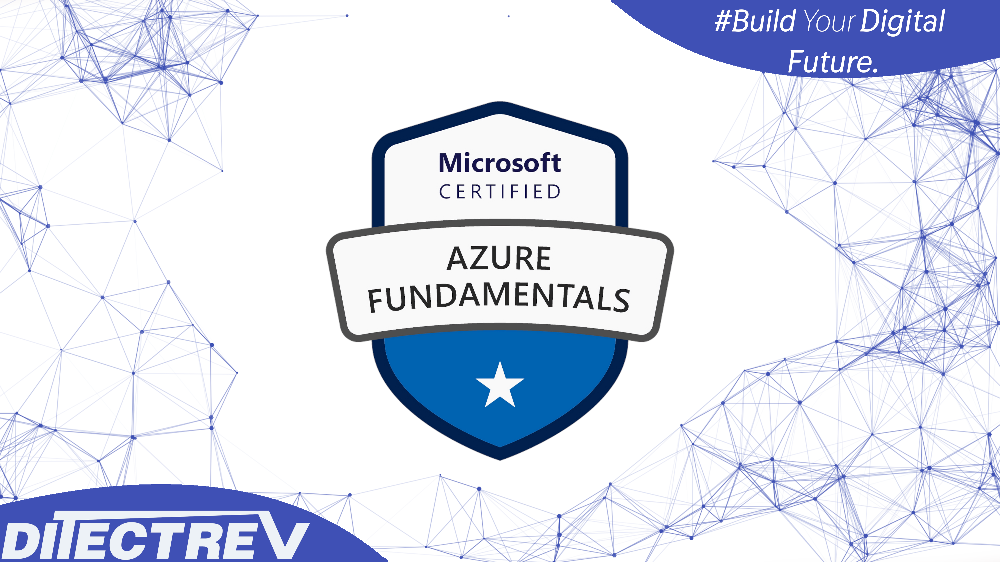

# 📚 Awesome Microsoft Azure AZ-900 (Microsoft Azure Fundamentals) Study Guide Book & Course



## ❣️ Support

There are many ways to support us; in exchange, you'll get this material in a proper format:

- ❤️ [shop.ditectrev.com, in EPUB or PDF formats](https://shop.ditectrev.com/product/awesome-microsoft-azure-az-900-microsoft-azure-fundamentals-study-guide-book),
- ▶️ [Udemy, in an interactive video course format](https://www.udemy.com/user/social-ditectrev),
- 🆓 [Shorter, but free, part of our Udemy course is available on YouTube](https://www.youtube.com/playlist?list=PLD1m9AjEIXDbVigQu5wRbEWUl39rUNlyJ),
- 📚 [Google Play Books, in PDF format](https://play.google.com/store/books/details?id=wKh_EQAAQBAJ),
- 🛍️ [Etsy, in PDF format](https://ditectrev.etsy.com/listing/4356430980),
- 🛒 [eBay, in PDF format](https://ebay.us/m/pU3KqA),
- 🔄 [Patreon subscription allows you to get access to all of the materials in EPUB and PDF formats. You can also buy separate items on Patreon, but the subscription technically allows us to include all updates for EPUB and PDF formats. Hence, you get EPUB and PDF updates when you subscribe to Patreon](https://patreon.com/Ditectrev?utm_medium=unknown&utm_source=join_link&utm_campaign=creatorshare_creator&utm_content=copyLink).

💰 If you work for a company, you could probably easily claim this expense while learning this topic. For us, it's about being in the game or not.

⭐ Good ratings & reviews help us to survive. Please don't forget to leave a nice one when you purchase an item.

## ✨ This Study Guide Book & Course is unlike any Microsoft Azure AZ-900 (Microsoft Azure Fundamentals) Study Guide Book & Course you will find online

✋ Join a live online community and a Study Guide Book & Course taught by industry experts and pass the Microsoft Azure AZ-900 (Microsoft Azure Fundamentals) confidently. We aim to build an ecosystem of Information Technology (IT) certifications and online courses in cooperation with the technology industry. We believe it will give our students 100% confidence in the pacing market in an open-source environment. We are just at the beginning of our way, so it's even better for you to join now!

[](https://discord.gg/RFjtXKfJy3)

## ⌛️ Short and to the point; why should you take the Study Guide Book & Course:

1. Always happy to answer your questions 😊
2. Unhappy? Please raise a refund; we'll always accept it 💸
3. Learn about topics, such as:
   - Access Control;
   - Authentication & Authorization;
   - Availability Zones;
   - Azure Advisor;
   - Azure Analysis Services;
   - Azure Command Line Interface (Azure CLI);
   - Azure Cosmos DB;
   - Azure Event Hubs;
   - Azure Functions;
   - Azure Log Analytics;
   - Azure Marketplace;
   - Azure Monitor;
   - Azure Multi-Factor Authentication (MFA);
   - Azure Pay-as-You-Go Subscription;
   - Azure Policies;
   - Azure Portal;
   - Azure Regions;
   - Azure Resources;
   - Azure Service Health;
   - Azure Services;
   - Azure SQL Databases;
   - Azure Storage;
   - Azure Web Apps;
   - Capital Expenditure (CapEx) & Operational Expenditure (OpEx);
   - Cloud Concepts;
   - Compliance, Governance, Identity & Privacy;
   - General Data Protection Regulation (GDPR) & Azure;
   - Inbound Data Traffic & Outbound Data Traffic;
   - Infrastructure as a Service (laaS);
   - Microsoft Defender for Cloud;
   - Microsoft Defender for Identity;
   - Microsoft Entra ID;
   - Microsoft Entra ID Protection;
   - Microsoft Trust Center;
   - Network Security Group (NSG);
   - Platform as a Service (PaaS);
   - PowerShell;
   - Public & Private Cloud;
   - Public & Private Preview;
   - Resource Groups;
   - Serverless;
   - Service Level Agreement (SLA);
   - Software as a Service (SaaS);
   - Virtual Machines (VMs);
   - Windows Virtual Desktop;
   - **Much More!**
4. Real Life examples ✅
5. The Study Guide Book & Course explains the topic fully in-depth 🔬

## ☝️ Study Guide Book & Course Updates

**[v1.0.0](../../releases/tag/v1.0.0): August 22, 2025.**

- Launch of the course.

## 🙋‍♀️ & 🙋‍♂️ Contribution

We are so thankful for every contribution, which makes sure we can deliver top-notch content. Whenever you find a missing resource, broken link in a [Table of Contents](../..#table-of-contents), the wrong answer, please submit an [issue](../../issues). Even better would be a [Pull Request (PR)](../../pulls).

## Who this Study Guide Book & Course is for:

- 👨‍🎓 Students preparing for the Microsoft Azure Fundamentals (AZ-900) Exam;
- 👨‍🎓 AWS Engineers;
- 👨‍🎓 Azure Engineers;
- 👨‍🎓 Cloud Architects;
- 👨‍🎓 Cloud Engineers;
- 👨‍🎓 DevOps Engineers;
- 👨‍🎓 Enterprise Architects;
- 👨‍🎓 Google Cloud Platform (GCP) Engineers;
- 👨‍🎓 Infrastructure Engineers;
- 👨‍🎓 IT Professionals;
- 👨‍🎓 Lead Engineers;
- 👨‍🎓 Product Architects;
- 👨‍🎓 Product Managers;
- 👨‍🎓 Product Owners;
- 👨‍🎓 Project Managers;
- 👨‍🎓 Scrum Masters;
- 👨‍🎓 Security Engineers;
- 👨‍🎓 Site Reliability Engineers;
- 👨‍🎓 Software Developers/Engineers;
- 👨‍🎓 Software Testers;
- 👨‍🎓 Solution Architects;
- 👨‍🎓 Team Leaders.

## Requirements

- 🤩 Excitement to learn!
- 0️⃣ Prior knowledge is required;
- ✅ You can pass the Microsoft Azure Fundamentals (AZ-900) Exam solely based on our Study Guide Book & Course.

## Table of Contents

- [Introduction](#introduction)
  - [What is Microsoft Azure?](#what-is-microsoft-azure)
  - [Brief History and Evolution of Azure](#brief-history-and-evolution-of-azure)
  - [Who Uses Azure?](#who-uses-azure)
  - [Key Azure Concepts for AZ-900](#key-azure-concepts-for-az-900)
  - [Cloud Computing Fundamentals](#cloud-computing-fundamentals)
    - [What is Cloud Computing?](#what-is-cloud-computing)
    - [Benefits of Cloud Computing](#benefits-of-cloud-computing)
  - [Cloud Service Models](#cloud-service-models)
- [Cloud Concepts](#cloud-concepts)
  - [Cloud Deployment Models](#cloud-deployment-models)
    - [Public Cloud](#public-cloud)
    - [Private Cloud](#private-cloud)
    - [Hybrid Cloud](#hybrid-cloud)
    - [Cloud Computing Challenges](#cloud-computing-challenges)
    - [Azure vs Other Cloud Platforms](#azure-vs-other-cloud-platforms)
    - [Professional Use Cases](#professional-use-cases)
  - [Cloud Computing Terms and Concepts](#cloud-computing-terms-and-concepts)
    - [High Availability](#high-availability)
    - [Scalability](#scalability)
    - [Elasticity](#elasticity)
    - [Fault Tolerance](#fault-tolerance)
    - [Disaster Recovery](#disaster-recovery)
  - [Cloud Economics](#cloud-economics)
    - [Capital Expenditure (CapEx) vs Operational Expenditure (OpEx)](#capital-expenditure-capex-vs-operational-expenditure-opex)
    - [Total Cost of Ownership (TCO)](#total-cost-of-ownership-tco)
    - [Cost Optimization Strategies](#cost-optimization-strategies)
  - [Shared Responsibility Model](#shared-responsibility-model)

- [Core Azure Services](#core-azure-services)
  - [Azure Compute Services](#azure-compute-services)
    - [Virtual Machines (VMs)](#virtual-machines-vms)
    - [Virtual Machine Scale Sets (VMSS)](#virtual-machine-scale-sets-vmss)
    - [Availability Sets](#availability-sets)
    - [Azure Virtual Desktop (AVD)](#azure-virtual-desktop-avd)
    - [App Service](#app-service)
    - [Azure Functions](#azure-functions)
  - [Azure Storage Services](#azure-storage-services)
    - [Blob Storage](#blob-storage)
    - [File Storage](#file-storage)
    - [Azure Storage](#azure-storage)
  - [Azure Networking](#azure-networking)
    - [Azure Virtual Network](#azure-virtual-network)
  - [Azure Databases](#azure-databases)
    - [Azure SQL Database](#azure-sql-database)
    - [Azure Cosmos DB](#azure-cosmos-db)
    - [Azure Database for PostgreSQL](#azure-database-for-postgresql)
    - [Azure Database for MySQL](#azure-database-for-mysql)
  - [Azure Management and Deployment Tools](#azure-management-and-deployment-tools)
    - [Azure Portal](#azure-portal)
    - [Azure Arc](#azure-arc)
    - [Azure CLI (Command-Line Interface)](#azure-cli-command-line-interface)
    - [Azure PowerShell](#azure-powershell)
    - [Azure Resource Manager (ARM)](#azure-resource-manager-arm)
    - [Azure DevOps](#azure-devops)
    - [Infrastructure as Code (IaC)](#infrastructure-as-code-iac)
  - [Azure Monitoring Tools](#azure-monitoring-tools)
    - [Azure Monitor](#azure-monitor)
    - [Application Insights](#application-insights)
    - [Log Analytics](#log-analytics)
    - [Network Watcher](#network-watcher)
    - [Azure Service Health](#azure-service-health)
    - [Azure Advisor](#azure-advisor)
    - [Best Practices for Monitoring](#best-practices-for-monitoring)
- [Security, Privacy, and Compliance](#security-privacy-and-compliance)
  - [Azure Identity, Access, and Security](#azure-identity-access-and-security)
    - [Azure Identity, Access, and Security Overview](#azure-identity-access-and-security-overview)
    - [Microsoft Defender for Cloud](#microsoft-defender-for-cloud)
    - [Azure Key Vault](#azure-key-vault)
    - [Microsoft Entra ID](#microsoft-entra-id)
  - [Privacy and Compliance](#privacy-and-compliance)
    - [Compliance Offerings](#compliance-offerings)
  - [Azure Governance and Compliance](#azure-governance-and-compliance)
    - [Azure Governance](#azure-governance)
    - [Compliance Management](#compliance-management)
    - [Cost Management and Governance](#cost-management-and-governance)
- [Azure Pricing and Support](#azure-pricing-and-support)
  - [Understanding Azure Pricing](#understanding-azure-pricing)
    - [Pricing Models](#pricing-models)
    - [Cost Management](#cost-management)
  - [Azure Support Options](#azure-support-options)
    - [Support Plans](#support-plans)
    - [Service Level Agreements (SLAs)](#service-level-agreements-slas)
- [Exam Preparation](#exam-preparation)
  - [AZ-900 Exam Overview](#az-900-exam-overview)
    - [Exam Structure](#exam-structure)
    - [Exam Topics](#exam-topics)
  - [Study Resources](#study-resources)
    - [Official Resources](#official-resources)
    - [Community Resources](#community-resources)
  - [Exam Tips](#exam-tips)
    - [Preparation](#preparation)
    - [During the Exam](#during-the-exam)
- [Conclusion](#conclusion)
  - [Key Takeaways](#key-takeaways)
  - [Next Steps](#next-steps)
  - [Additional Resources](#additional-resources)
- [Appendices](#appendices)
  - [Glossary](#glossary)

## Introduction

### What is Microsoft Azure?

Microsoft Azure is a comprehensive cloud computing platform created by Microsoft for building, testing, deploying, and managing applications and services through Microsoft-managed data centers. It provides a wide range of cloud services, including those for computing, analytics, storage, and networking.

### Brief History and Evolution of Azure

Microsoft Azure was first announced in 2008 as "Project Red Dog" and was officially launched in 2010 as "Windows Azure." The platform has evolved significantly over the years:

- 2010: Initial launch as Windows Azure
- 2014: Renamed to Microsoft Azure
- 2016: Introduction of Azure Stack
- 2018: Launch of Azure Arc
- 2020: Introduction of Azure Synapse Analytics
- 2022: Launch of Azure OpenAI Service

### Who Uses Azure?

Azure's user base includes:

- Enterprise organizations
- Small and medium businesses
- Startups and developers
- Government agencies
- Educational institutions
- Healthcare providers
- Financial services
- Manufacturing companies

### Key Azure Concepts for AZ-900

1. **Resource Groups**
     Resource groups are logical containers that hold related Azure resources for an application. Think of them as folders that help you organize and manage all the resources needed for a specific project or application.

   - **Practical Example:**
     Imagine you're building a web application. Your resource group might contain:
     - A web app (App Service)
     - A database (Azure SQL Database)
     - A storage account for images
     - A virtual network for connectivity

   - **Why are they important?**
     - Organization: Keep related resources together
     - Management: Apply policies and permissions to all resources at once
     - Cost tracking: Monitor spending for specific projects
     - Lifecycle management: Delete all resources together when no longer needed

   - **Documentation Reference:**
     [Azure Resource Groups Documentation](https://learn.microsoft.com/en-us/azure/azure-resource-manager/management/manage-resource-groups-portal)

2. **Subscriptions**
     Subscriptions are the fundamental unit of billing and access management in Azure. They represent a billing relationship with Microsoft and provide a boundary for resource management.

   - **Practical Example:**
     A company might have different subscriptions for:
     - Development environment
     - Testing environment
     - Production environment

     Each with its own billing and access controls.

   - **Types of Subscriptions:**
     - **Free Trial**: 12 months of free services with $200 credit
     - **Pay-as-you-go**: Pay only for what you use
     - **Enterprise Agreement**: For large organizations with volume licensing
     - **Student**: Free services for verified students

   - **Documentation Reference:**
     [Azure Subscriptions Documentation](https://learn.microsoft.com/en-us/azure/cost-management-billing/manage/create-subscription)

3. **Management Groups**
     Management groups provide a level of scope above subscriptions. They help you organize subscriptions into containers and apply governance conditions to those containers.

   - **Practical Example:**
     A multinational company might organize their Azure resources like this:

     ```plaintext
     Root Management Group
     ├── North America
     │   ├── Production Subscriptions
     │   └── Development Subscriptions
     ├── Europe
     │   ├── Production Subscriptions
     │   └── Development Subscriptions
     └── Asia
         ├── Production Subscriptions
         └── Development Subscriptions
     ```

   - **Why use them?**
     - Apply policies across multiple subscriptions
     - Manage access control at scale
     - Organize subscriptions by department, environment, or region
     - Implement consistent governance

   - **Documentation Reference:**
     [Azure Management Groups Documentation](https://learn.microsoft.com/en-us/azure/governance/management-groups/overview)

4. **Regions and Availability Zones**
   - **What are they?**
     - **Regions**: Geographic areas containing one or more data centers
     - **Availability Zones**: Physically separate data centers within a region

   - **Practical Example:**
     Let's say you're deploying a critical application:

     ```plaintext
     Region: East US
     ├── Availability Zone 1: Primary data center
     ├── Availability Zone 2: Backup data center
     └── Availability Zone 3: Disaster recovery
     ```

     This setup ensures your application remains available even if one data center fails.

   - **Why are they important?**
     - **High Availability**: Deploy resources across multiple zones
     - **Disaster Recovery**: Protect against regional outages
     - **Data Residency**: Meet compliance requirements
     - **Performance**: Choose regions close to your users

   - **Region Pairs**:
     - **What are they?**
       Region pairs are two regions within the same geography that are paired together for disaster recovery and high availability.

     - **Practical Example:**

       ```plaintext
       North America Region Pairs:
       ├── East US
       │   └── West US
       ├── Central US
       │   └── East US 2
       ├── North Central US
       │   └── South Central US
       └── West US 2
           └── West US 3
       ```

     - **Key Benefits**:

       ```plaintext

       Region Pair Benefits:
       ├── Disaster Recovery
       │   ├── Automatic replication
       │   └── Failover support
       ├── High Availability
       │   ├── Cross-region redundancy
       │   └── Load distribution
       ├── Data Residency
       │   ├── Compliance requirements
       │   └── Data sovereignty
       └── Maintenance
           ├── Planned updates
           └── Service updates
       ```

     - **Important Characteristics**:
       - Direct fiber-optic connection between paired regions
       - Automatic replication of data between pairs
       - Sequential updates to minimize downtime
       - Guaranteed recovery time objectives (RTO)
       - Compliance with data residency requirements

     - **Use Cases**:

       ```plaintext
       Common Scenarios:
       ├── Disaster Recovery
       │   ├── Business continuity
       │   └── Data protection
       ├── High Availability
       │   ├── Multi-region deployment
       │   └── Load balancing
       ├── Compliance
       │   ├── Data residency
       │   └── Regulatory requirements
       └── Performance
           ├── Global distribution
           └── Low latency
       ```

     - **Sovereign Regions**:
       - **What are they?**
         Sovereign regions are special Azure regions that are physically and logically isolated from the main Azure regions, designed to meet specific data sovereignty, compliance, and security requirements.

       - **Available Sovereign Regions**:

         ```plaintext
         Sovereign Regions:
         ├── US Government
         │   ├── US Gov Virginia
         │   ├── US Gov Texas
         │   ├── US Gov Arizona
         │   └── US Gov DoD
         ├── China
         │   ├── China East
         │   └── China North
         └── Germany
             ├── Germany Central
             └── Germany Northeast
         ```

       - **Key Characteristics**:

         ```plaintext
         Sovereign Features:
         ├── Physical Isolation
         │   ├── Separate data centers
         │   └── Dedicated infrastructure
         ├── Logical Isolation
         │   ├── Separate network
         │   └── Access controls
         ├── Compliance
         │   ├── Government standards
         │   └── Industry regulations
         └── Operations
             ├── Local operations
             └── Specialized support
         ```

       - **Use Cases**:

         ```plaintext
         Common Scenarios:
         ├── Government
         │   ├── Federal agencies
         │   ├── Defense contracts
         │   └── Public sector
         ├── Regulated Industries
         │   ├── Healthcare
         │   ├── Financial services
         │   └── Critical infrastructure
         └── Compliance Requirements
             ├── Data sovereignty
             ├── Regulatory compliance
             └── Security standards
         ```

       - **Important Considerations**:
         - Separate Azure portal and management tools
         - Different service availability
         - Specialized compliance certifications
         - Unique pricing and licensing
         - Restricted access requirements
         - Separate support channels

       - **Documentation Reference:**
         [Azure Sovereign Regions](https://learn.microsoft.com/en-us/azure/azure-government/documentation-government-welcome)

     - **Azure Datacenters**:
       - **What are they?**
         Azure datacenters are physical facilities that house the computing infrastructure for Azure services, designed with multiple layers of security, redundancy, and environmental controls.

       - **Key Components**:

           ```plaintext
           Datacenter Components:
           ├── Physical Security
           │   ├── 24/7 security personnel
           │   ├── Biometric access
           │   ├── Video surveillance
           │   └── Security perimeters
           ├── Infrastructure
           │   ├── Power systems
           │   │   ├── Multiple power feeds
           │   │   ├── UPS systems
           │   │   └── Backup generators
           │   ├── Cooling systems
           │   │   ├── Redundant cooling
           │   │   └── Temperature control
           │   └── Network
           │       ├── Fiber connectivity
           │       └── Redundant paths
           └── Environmental Controls
               ├── Fire suppression
               ├── Flood protection
               └── Climate control
           ```

       - **Security Features**:

           ```plaintext
           Security Measures:
           ├── Physical Security
           │   ├── Access control
           │   ├── Security cameras
           │   └── Intrusion detection
           ├── Network Security
           │   ├── DDoS protection
           │   ├── Firewalls
           │   └── Encryption
           └── Operational Security
               ├── Staff screening
               ├── Security protocols
               └── Incident response
           ```

       - **Environmental Considerations**:

           ```plaintext
           Environmental Features:
           ├── Power Management
           │   ├── Energy efficiency
           │   ├── Renewable energy
           │   └── Power monitoring
           ├── Cooling Systems
           │   ├── Efficient cooling
           │   ├── Temperature monitoring
           │   └── Humidity control
           └── Sustainability
               ├── Green initiatives
               ├── Waste reduction
               └── Carbon footprint
           ```

       - **Operational Features**:

           ```plaintext
           Operations:
           ├── Monitoring
           │   ├── 24/7 monitoring
           │   ├── Performance tracking
           │   └── Health checks
           ├── Maintenance
           │   ├── Preventive maintenance
           │   ├── Equipment updates
           │   └── System upgrades
           └── Support
               ├── Technical support
               ├── Emergency response
               └── Service restoration
           ```

       - **Compliance and Certifications**:

           ```plaintext
           Certifications:
           ├── ISO Standards
           │   ├── ISO 27001
           │   ├── ISO 27018
           │   └── ISO 22301
           ├── Industry Standards
           │   ├── SOC 1/2/3
           │   ├── PCI DSS
           │   └── HIPAA
           └── Regional Compliance
               ├── GDPR
               ├── CCPA
               └── Local regulations
           ```

       - **Important Considerations**:
           - Multiple layers of redundancy
           - Continuous monitoring and maintenance
           - Regular security audits
           - Environmental impact management
           - Compliance with local regulations
           - Disaster recovery capabilities

       - **Documentation Reference:**
         [Azure Datacenter Security](https://learn.microsoft.com/en-us/azure/security/fundamentals/physical-security)
         [Azure Compliance](https://learn.microsoft.com/en-us/azure/compliance/)

   - **Documentation Reference:**
     [Azure Regions and Availability Zones](https://learn.microsoft.com/en-us/azure/availability-zones/az-overview)
     [Azure Region Pairs](https://learn.microsoft.com/en-us/azure/best-practices-availability-paired-regions)

### Cloud Computing Fundamentals

#### What is Cloud Computing?

Cloud computing is the delivery of computing services over the internet, including servers, storage, databases, networking, software, analytics, and intelligence. Instead of owning and maintaining physical servers, you can access these resources on-demand from a cloud provider.

**Real-World Analogy:**
Think of cloud computing like electricity. Instead of generating your own power, you pay for what you use from a utility company. Similarly, with cloud computing, you pay for computing resources as you need them, rather than maintaining your own infrastructure.

#### Benefits of Cloud Computing

1. **Cost Efficiency**
   - **What it means:**
     Pay only for what you use, with no upfront infrastructure costs.

   - **Practical Example:**
     A startup launching a web application:

     ```plaintext
     Traditional Approach:
     ├── Buy servers: $10,000
     ├── Network equipment: $5,000
     ├── Data center space: $2,000/month
     └── IT staff: $8,000/month

     Cloud Approach:
     ├── Pay-as-you-go: ~$500/month
     ├── Scale as needed
     └── No upfront costs
     ```

2. **Scalability**
   - **What it means:**
     The ability to increase or decrease resources based on demand.

   - **Practical Example:**
     An e-commerce website during holiday season:

     ```plaintext
     Traffic Patterns:
     ├── Normal traffic: 1,000 users/hour
     ├── Holiday traffic: 10,000 users/hour
     ├── Cloud solution automatically scales
     └── Returns to normal capacity after holiday
     ```

   - **Documentation Reference:**
     [Azure Autoscaling Documentation](https://learn.microsoft.com/en-us/azure/azure-monitor/autoscale/autoscale-overview)

3. **Performance**
   - **What it means:**
     Access to the latest hardware and global network infrastructure.

   - **Practical Example:**
     A global company serving customers worldwide:
     - Deploy applications in multiple regions
     - Use Azure's global network
     - Implement CDN for static content
     - Result: Low latency for all users

   - **Documentation Reference:**
     [Azure Global Infrastructure](https://azure.microsoft.com/en-us/global-infrastructure/)

4. **Security**
   - **What it means:**
     Advanced security features and regular updates managed by the cloud provider.

   - **Practical Example:**
     A healthcare application handling patient data:
     - Azure handles physical security
     - Automatic security updates
     - Built-in DDoS protection
     - Compliance certifications (HIPAA, GDPR)

   - **Documentation Reference:**
     [Azure Security Documentation](https://learn.microsoft.com/en-us/azure/security/)

5. **Reliability**
   - **What it means:**
     High availability and disaster recovery capabilities.

   - **Practical Example:**
     A banking application requiring 99.99% uptime:
     - Deploy across multiple availability zones
     - Automatic failover
     - Regular backups
     - Disaster recovery plan

   - **Documentation Reference:**
     [Azure Reliability Documentation](https://learn.microsoft.com/en-us/azure/well-architected/reliability/)

6. **Predictability**
   - **What it means:**
     Consistent performance, predictable costs, and reliable service delivery through standardized infrastructure and automated management.

   - **Practical Example:**
     A retail application during peak shopping seasons:

     ```plaintext
     Predictability Benefits:
     ├── Performance
     │   ├── Consistent response times
     │   ├── Standardized infrastructure
     │   └── Automated scaling
     ├── Cost
     │   ├── Predictable billing
     │   ├── Reserved capacity pricing
     │   └── Usage-based costs
     └── Operations
         ├── Automated maintenance
         ├── Standardized updates
         └── SLA guarantees
     ```

   - **Key Aspects:**
     - **Performance Predictability:**
       - Consistent infrastructure
       - Standardized configurations
       - Automated scaling
       - SLA-backed performance

     - **Cost Predictability:**
       - Transparent pricing
       - Usage-based billing
       - Reserved instance options
       - Budget controls

     - **Operational Predictability:**
       - Automated maintenance
       - Standardized updates
       - Consistent security
       - Regular compliance checks

   - **Documentation Reference:**
     [Azure Service Level Agreements](https://www.microsoft.com/licensing/docs/view/Service-Level-Agreements-SLA-for-Online-Services)

7. **Governance**
   - **What it means:**
     Centralized tools and policies to manage, monitor, and control cloud resources and ensure compliance.

   - **Practical Example:**
     An enterprise uses Azure Policy and Management Groups to enforce naming conventions, resource tagging, and compliance requirements across all subscriptions.

   - **Key Aspects:**
     - Policy enforcement
     - Resource organization
     - Compliance tracking
     - Audit and reporting

   - **Documentation Reference:**
     [Azure Governance Documentation](https://learn.microsoft.com/en-us/azure/governance/)

8. **Manageability**
   - **What it means:**
     Simplified and automated management of resources using built-in tools, APIs, and dashboards.

   - **Practical Example:**
     A company uses the Azure Portal, Azure CLI, and automation scripts to deploy, monitor, and update resources efficiently.

   - **Key Aspects:**
     - Centralized management (portal, CLI, PowerShell)
     - Automation (ARM templates, scripts)
     - Monitoring and alerting
     - Resource consistency

   - **Documentation Reference:**
     [Azure Management Tools Documentation](https://learn.microsoft.com/en-us/azure/azure-portal/)

9. **Elasticity**
   - **What it means:**
     The ability to automatically scale resources up or down based on demand, ensuring optimal performance and cost efficiency.

   - **Practical Example:**
     An e-commerce site automatically scales out web servers during a sale and scales back in after traffic returns to normal.

   - **Key Aspects:**
     - Auto-scaling
     - Rapid provisioning and deprovisioning
     - Pay only for what you use
     - No need for over-provisioning

   - **Documentation Reference:**
     [Azure Autoscale Documentation](https://learn.microsoft.com/en-us/azure/azure-monitor/autoscale/autoscale-overview)

- **Key Points**:
  - Cloud computing eliminates upfront infrastructure costs
  - Pay-as-you-go model provides cost efficiency
  - Automatic scaling ensures optimal performance
  - Built-in security and compliance features
  - Global reach with local data centers
  - Reduced IT management overhead

### Cloud Service Models

1. **Infrastructure as a Service (IaaS)**
   - **What it is:**
     Azure IaaS provides virtualized computing resources over the internet. You manage the operating system, middleware, and applications, while Azure manages the physical infrastructure.

   - **Azure Examples:**
     - **Azure Virtual Machines**: Complete control over OS and applications
     - **Azure Storage**: Scalable storage solutions (Blob, File, Queue, Table)
     - **Azure Virtual Network**: Private networking and connectivity
     - **Azure Load Balancer**: Traffic distribution and high availability

   - **Practical Example:**
     A company migrating their on-premises servers to Azure:

     ```plaintext
     Before Migration:
     ├── Physical Servers ($50,000)
     │   ├── Database Server
     │   ├── Web Server
     │   └── Application Server
     └── IT Staff ($100,000/year)
         ├── System Administration
         └── Maintenance

     After Migration to Azure IaaS:
     ├── Azure VMs ($2,000/month)
     │   ├── D4s v3 for Database
     │   ├── B2s for Web Server
     │   └── D2s v3 for Application
     └── Reduced IT Staff ($50,000/year)
         └── Focus on Application Management
     ```

   - **Documentation Reference:**
     [Azure Virtual Machines Documentation](https://learn.microsoft.com/en-us/azure/virtual-machines/)

2. **Platform as a Service (PaaS)**
   - **What it is:**
     Azure PaaS provides a platform allowing customers to develop, run, and manage applications without the complexity of building and maintaining the infrastructure.

   - **Azure Examples:**
     - **Azure App Service**: Managed web application hosting with built-in CI/CD
     - **Azure Functions**: Serverless compute for event-driven applications
     - **Azure SQL Database**: Fully managed relational database service
     - **Azure Kubernetes Service (AKS)**: Managed Kubernetes container orchestration

   - **Practical Example:**
     A web application deployment:

     ```plaintext
     PaaS Architecture:
     ├── App Service for web app
     │   ├── Automatic scaling
     │   └── Built-in CI/CD
     ├── Azure SQL Database
     │   ├── Managed database
     │   └── Automatic backups
     └── Azure Storage
         ├── Blob storage for files
         └── CDN for content delivery
     ```

   - **Common Use Cases:**
     - **Web Application Development:**

       ```plaintext
       Modern Web App:
       ├── Frontend: Azure Static Web Apps
       │   ├── React/Angular/Vue
       │   └── Cost: Free tier available
       ├── Backend: Azure App Service
       │   ├── .NET/Node.js/Python
       │   └── Cost: ~$75/month
       └── Database: Azure SQL
           ├── Basic tier
           └── Cost: ~$5/month
       ```

     - **Mobile App Backend:**

       ```plaintext
       Mobile App Infrastructure:
       ├── API: Azure API Management
       ├── Authentication: Microsoft Entra ID B2C
       ├── Push Notifications: Azure Notification Hubs
       └── Data: Azure Cosmos DB
       ```

     - **Business Analytics:**

       ```plaintext
       Analytics Platform:
       ├── Data Lake: Azure Data Lake Storage
       ├── Processing: Azure Synapse Analytics
       ├── Visualization: Power BI
       └── Machine Learning: Azure ML
       ```

   - **Documentation Reference:**
     [Azure App Service Documentation](https://learn.microsoft.com/en-us/azure/app-service/)

3. **Software as a Service (SaaS)**
   - **What it is:**
     Azure SaaS delivers software applications over the internet, eliminating the need to install and run applications on individual computers.

   - **Azure Examples:**
     - **Microsoft 365**: Complete productivity suite (Office, Teams, SharePoint)
     - **Salesforce**: Customer relationship management platform
     - **Dropbox**: Cloud file storage and sharing
     - **Zoom**: Video conferencing and communication platform

   - **Practical Example:**
     Enterprise productivity tools:

     ```plaintext
     SaaS Solutions:
     ├── Microsoft 365
     │   ├── Office applications
     │   └── Teams collaboration
     ├── Dynamics 365
     │   ├── CRM functionality
     │   └── ERP capabilities
     └── Power Platform
         ├── Power BI analytics
         └── Power Apps development
     ```

   - **Common Use Cases:**
     - **Enterprise Productivity:**

       ```plaintext
       Microsoft 365 Setup:
       ├── Office Apps
       ├── Teams for Collaboration
       ├── SharePoint for Document Management
       └── OneDrive for File Storage
       ```

     - **Business Applications:**

       ```plaintext
       Dynamics 365 Implementation:
       ├── Sales Module
       ├── Customer Service
       ├── Finance and Operations
       └── Human Resources
       ```

     - **Development Tools:**

       ```plaintext
       Azure DevOps Services:
       ├── Source Control
       ├── CI/CD Pipelines
       ├── Project Management
       └── Test Management
       ```

   - **Documentation Reference:**
     [Microsoft 365 Documentation](https://learn.microsoft.com/en-us/microsoft-365/)

- **Key Points**:
  - IaaS provides maximum control but requires more management
  - PaaS offers development platform with managed infrastructure
  - SaaS delivers ready-to-use applications with minimal setup
  - Choose service model based on control needs vs. management overhead
  - Higher service levels reduce operational complexity

## Cloud Concepts

### Cloud Deployment Models

#### Public Cloud

- **What it is:**
  Services available to the general public, hosted in the cloud provider's data centers.

- **Practical Example:**
  A startup launching a new application:

  ```plaintext
  Public Cloud Setup:
  ├── Azure App Service for web app
  ├── Azure SQL Database for data
  ├── Azure Storage for files
  └── Azure CDN for content delivery
  ```

- **Benefits:**
  - No upfront costs
  - Automatic scaling
  - Managed infrastructure
  - Global reach

- **Documentation Reference:**
  [Azure Public Cloud Documentation](https://learn.microsoft.com/en-us/azure/cloud-adoption-framework/ready/azure-setup-guide/)

#### Private Cloud

- **What it is:**
  Cloud infrastructure dedicated to a single organization, either on-premises or hosted by a third party.

- **Practical Example:**
  A financial institution with strict compliance requirements:

  ```plaintext
  Private Cloud Setup:
  ├── Dedicated hardware
  ├── Isolated network
  ├── Custom security policies
  └── On-premises control
  ```

- **Benefits:**
  - Enhanced security
  - Custom compliance
  - Full control
  - Predictable performance

- **Documentation Reference:**
  [Azure Stack Documentation](https://learn.microsoft.com/en-us/azure-stack/)

#### Hybrid Cloud

- **What it is:**
  Combination of public and private clouds, allowing data and applications to be shared between them.

- **Practical Example:**
  A company with existing on-premises infrastructure:

  ```plaintext
  Hybrid Cloud Setup:
  ├── On-Premises:
  │   ├── Legacy applications
  │   └── Sensitive data
  └── Azure:
      ├── New applications
      ├── Backup and recovery
      └── Burst capacity
  ```

- **Benefits:**
  - Flexibility
  - Cost optimization
  - Security control
  - Workload portability

- **Documentation Reference:**
  [Azure Hybrid Cloud Documentation](https://learn.microsoft.com/en-us/azure/architecture/hybrid/hybrid-start-here)

#### Cloud Computing Challenges

While cloud computing offers numerous benefits, organizations also face several challenges when adopting cloud technologies:

- **Security and Privacy**:
  - Data protection concerns
  - Compliance requirements
  - Identity and access management
  - Threat protection
  - Data sovereignty issues

- **Internet Dependency**:
  - Reliance on internet connectivity
  - Potential service outages
  - Bandwidth limitations
  - Network latency issues

- **Vendor Lock-in**:
  - Proprietary technologies
  - Data migration difficulties
  - Service-specific APIs
  - Switching costs

- **Cost Management**:
  - Unpredictable costs
  - Resource optimization
  - Budget overruns
  - Complex pricing models

#### Azure vs Other Cloud Platforms

| Feature | Azure | AWS | Google Cloud |
|---------|-------|-----|--------------|
| Market Share | Second | First | Third |
| Global Regions | 60+ | 25+ | 35+ |
| Learning Curve | Moderate | Steep | Moderate |
| Integration | Strong with Microsoft | Broad | Strong with Google |
| Pricing Model | Pay-as-you-go | Pay-as-you-go | Pay-as-you-go |
| Free Tier | 12 months | 12 months | 90 days |
| Compliance | Extensive | Extensive | Extensive |
| Support | Enterprise-grade | Enterprise-grade | Enterprise-grade |
| Documentation | Comprehensive | Comprehensive | Comprehensive |

#### Professional Use Cases

- **Enterprise Solutions**:
  - Hybrid cloud deployments
  - Enterprise resource planning
  - Business intelligence
  - Disaster recovery
  - Identity management

- **Development and DevOps**:
  - Application development
  - Continuous integration/deployment
  - Container orchestration
  - Serverless computing
  - Microservices architecture

- **Data and Analytics**:
  - Big data processing
  - Machine learning
  - Business analytics
  - Data warehousing
  - Real-time analytics

- **Internet of Things (IoT)**:
  - Device management
  - Data collection
  - Real-time monitoring
  - Predictive maintenance
  - Edge computing

- **Security and Compliance**:
  - Identity protection
  - Threat detection
  - Compliance management
  - Data encryption
  - Access control

### Cloud Computing Terms and Concepts

#### High Availability

- **Definition**: System design ensuring continuous operation
- **Components**:
  - Redundancy
  - Failover
  - Load balancing
  - Disaster recovery

#### Scalability

- **Definition**: The ability of a system to handle increased load by adding resources (scaling up/out) or removing resources (scaling down/in) to maintain performance and meet demand
- **Types**:
  - Vertical scaling
  - Horizontal scaling
  - Auto-scaling
  - Load balancing

#### Elasticity

- **Definition**: Ability to scale resources up or down
- **Benefits**:
  - Cost optimization
  - Performance optimization
  - Resource efficiency
  - Automatic scaling

#### Fault Tolerance

- **Definition**: System's ability to continue operating despite failures
- **Components**:
  - Redundancy
  - Replication
  - Backup systems
  - Failover mechanisms

#### Disaster Recovery

- **Definition**: Process of recovering from system failures
- **Components**:
  - Backup strategies
  - Recovery plans
  - Testing procedures
  - Documentation

### Cloud Economics

Understanding cloud economics is crucial for making informed decisions about cloud adoption and cost management.

#### Capital Expenditure (CapEx) vs Operational Expenditure (OpEx)

- **Traditional IT (CapEx)**:
  - High upfront costs for hardware and software
  - Capital investments in infrastructure
  - Depreciation over time
  - Long-term planning required

- **Cloud Computing (OpEx)**:
  - Pay-as-you-go model
  - No upfront capital investment
  - Predictable monthly costs
  - Flexible scaling based on needs

#### Total Cost of Ownership (TCO)

TCO includes all costs associated with owning and operating IT infrastructure:

- **Hardware and software costs**:
  - Server hardware
  - Storage devices
  - Networking equipment
  - Software licenses

- **Operational and maintenance costs**:
  - IT staff salaries
  - Training and certification
  - Support contracts
  - Regular maintenance

- **Power and cooling costs**:
  - Electricity consumption
  - Heating, Ventilation, and Air Conditioning (HVAC) systems
  - Data center facilities
  - Environmental controls

#### Cost Optimization Strategies

Effective cost management in the cloud involves several strategies:

- **Right-sizing resources**:
  - Match resource capacity to actual needs
  - Monitor usage patterns
  - Scale down underutilized resources
  - Choose appropriate service tiers

- **Reserved instances**:
  - Commit to 1 or 3-year terms
  - Significant cost savings (up to 72%)
  - Predictable workloads
  - Budget planning

- **Spot instances**:
  - Use unused capacity at discounted rates
  - Up to 90% cost savings
  - Suitable for fault-tolerant workloads
  - Risk of interruption

- **Auto-scaling**:
  - Automatically adjust resources based on demand
  - Pay only for what you need
  - Maintain performance during peak times
  - Reduce costs during low usage

### Shared Responsibility Model

- **Definition**: A framework that defines which security tasks are handled by the cloud provider and which tasks are handled by the customer.

- **Practical Example**:

  ```plaintext
  IaaS Responsibility Split:
  ├── Cloud Provider
  │   ├── Physical security
  │   ├── Network infrastructure
  │   ├── Host infrastructure
  │   └── Virtualization layer
  └── Customer
      ├── Operating system
      ├── Network configuration
      ├── Application security
      └── Data security

  PaaS Responsibility Split:
  ├── Cloud Provider
  │   ├── Physical security
  │   ├── Network infrastructure
  │   ├── Host infrastructure
  │   ├── Operating system
  │   └── Runtime environment
  └── Customer
      ├── Application security
      ├── Data security
      └── Access management

  SaaS Responsibility Split:
  ├── Cloud Provider
  │   ├── Physical security
  │   ├── Network infrastructure
  │   ├── Host infrastructure
  │   ├── Operating system
  │   ├── Application security
  │   └── Runtime environment
  └── Customer
      ├── Data security
      └── Access management
  ```

- **Key Points**:
  - **Physical Security**: Always managed by the cloud provider
  - **Data Security**: Always shared responsibility
  - **Application Security**: Varies by service model
  - **Network Security**: Varies by service model

## Core Azure Services

### Azure Compute Services

#### Virtual Machines (VMs)

  Azure VMs are on-demand, scalable computing resources that provide complete control over the operating system and configuration. They're ideal for running applications that require full control over the computing environment.

- **What is a vCPU?**
  A vCPU (virtual CPU) is a virtual processor that represents a portion of a physical CPU core. In Azure, vCPUs are the fundamental unit of compute power for virtual machines. Each vCPU:
  - Represents a portion of a physical CPU core
  - Provides consistent performance
  - Can be scaled up or down based on workload needs
  - Is billed based on usage

  **Key Characteristics:**
  - **Performance:** Each vCPU provides consistent compute power
  - **Isolation:** Workloads are isolated between vCPUs
  - **Scalability:** Can be increased or decreased based on needs
  - **Cost:** Billed per vCPU-hour of usage

  **Practical Example:**

  ```plaintext
  VM Size Examples:
  ├── B2s (Budget)
  │   ├── 2 vCPUs
  │   ├── 4 GB RAM
  │   └── Cost: ~$50/month
  ├── D4s v3 (General Purpose)
  │   ├── 4 vCPUs
  │   ├── 16 GB RAM
  │   └── Cost: ~$200/month
  └── H16r (High Performance)
      ├── 16 vCPUs
      ├── 448 GB RAM
      └── Cost: ~$2,000/month
  ```

  **Common Use Cases:**
  - **Web Servers:**

    ```plaintext
    Web Server VM:
    ├── 2-4 vCPUs
    ├── 4-8 GB RAM
    └── Standard SSD
    ```

  - **Database Servers:**

    ```plaintext
    Database Server VM:
    ├── 4-8 vCPUs
    ├── 16-32 GB RAM
    └── Premium SSD
    ```

  - **Application Servers:**

    ```plaintext
    App Server VM:
    ├── 2-4 vCPUs
    ├── 8-16 GB RAM
    └── Standard SSD
    ```

- **Practical Example:**
  A company running a legacy application:

  ```plaintext
  VM Configuration:
  ├── Windows Server 2019
  │   ├── 4 vCPUs
  │   ├── 16 GB RAM
  │   └── 256 GB SSD
  ├── Network Security
  │   ├── NSG Rules
  │   └── Private IP
  └── Monitoring
      ├── Performance Metrics
      └── Health Alerts
  ```

- **Common Use Cases:**
  - **Development and Testing:**

    ```plaintext
    Dev Environment:
    ├── Dev VM: B2s ($50/month)
    │   ├── 2 vCPUs
    │   └── 4 GB RAM
    ├── Test VM: B2s ($50/month)
    │   ├── 2 vCPUs
    │   └── 4 GB RAM
    └── Staging VM: D2s v3 ($100/month)
        ├── 2 vCPUs
        └── 8 GB RAM
    ```

  - **High-Performance Computing:**

    ```plaintext
    HPC Cluster:
    ├── Compute Nodes: H-series VMs
    │   ├── 8-64 vCPUs
    │   └── Up to 448 GB RAM
    ├── Storage: Premium SSD
    │   └── Up to 32 TB
    └── Network: Accelerated Networking
        └── 40 Gbps
    ```

  - **Disaster Recovery:**

    ```plaintext
    DR Setup:
    ├── Primary Site (On-premises)
    │   ├── Production Servers
    │   └── Active Directory
    └── Azure DR Site
        ├── Replica VMs
        └── Azure Site Recovery
    ```

- **Cost Optimization:**

  ```plaintext
  VM Cost Management:
  ├── Reserved Instances
  │   ├── 1-year commitment: 40% savings
  │   └── 3-year commitment: 60% savings
  │   └── Commitment to use specific VM types for fixed period
  │   └── Best for predictable, continuous workloads
  ├── Spot VMs
  │   └── Up to 90% savings
  │   └── No SLA, can be evicted with 30s notice
  │   └── Best for batch processing and development
  └── Auto-scaling
      ├── Scale out: Peak hours
      └── Scale in: Off-hours
      └── Automatically adjusts VM instances based on demand
      └── Best for applications with variable workloads
  ```

- **Documentation Reference:**
  [Azure Virtual Machines Documentation](https://learn.microsoft.com/en-us/azure/virtual-machines/)

- **Key Points**:
  - VMs provide complete control over OS and configuration
  - Choose VM size based on CPU, memory, and storage needs
  - Use Reserved Instances for predictable workloads to save costs
  - Spot VMs offer significant savings for flexible workloads
  - Always consider high availability with availability sets or zones
  - Monitor performance and scale based on actual usage patterns

#### Virtual Machine Scale Sets (VMSS)

- **What is it?**
  Azure Virtual Machine Scale Sets provide automatic scaling of virtual machines based on demand or a defined schedule.

- **Key Characteristics:**
  - **Collection of VMs**: A group of identical virtual machines managed as a single unit
  - **Automatic Management**: Automatically handles the creation and scaling of VMs based on demand

- **Practical Example:**
  A web application with variable traffic:

  ```plaintext
  Scale Set Configuration:
  ├── Automatic Scaling
  │   ├── Based on CPU usage
  │   ├── Based on memory usage
  │   └── Based on custom metrics
  ├── High Availability
  │   ├── Multiple fault domains
  │   └── Multiple update domains
  ├── Load Balancing
  │   ├── Automatic distribution
  │   └── Health monitoring
  └── Cost Optimization
      ├── Spot instances
      └── Reserved instances
  ```

- **Common Use Cases:**
  - **Web Applications:**

    ```plaintext
    Web App Scaling:
    ├── Peak Hours
    │   ├── Scale out: 10 instances
    │   └── Handle high traffic
    ├── Normal Hours
    │   ├── Scale in: 3 instances
    │   └── Cost optimization
    └── Off Hours
        ├── Scale in: 1 instance
        └── Minimal cost
    ```

  - **Batch Processing:**

    ```plaintext
    Batch Processing:
    ├── Job Submission
    │   ├── Scale out: 50 instances
    │   └── Process jobs
    ├── Job Completion
    │   ├── Scale in: 5 instances
    │   └── Monitor remaining jobs
    └── Idle State
        ├── Scale in: 0 instances
        └── Zero cost
    ```

- **Documentation Reference:**
  [Azure Virtual Machine Scale Sets Documentation](https://learn.microsoft.com/en-us/azure/virtual-machine-scale-sets/)

#### Availability Sets

- **What is it?**
  Availability Sets help ensure that VM applications are available during planned or unplanned maintenance events by distributing VMs across multiple isolated hardware nodes.

- **Practical Example:**
  A high-availability application:

  ```plaintext
  Availability Set Configuration:
  ├── Fault Domains
  │   ├── Separate power sources
  │   ├── Separate network switches
  │   └── Separate cooling systems
  ├── Update Domains
  │   ├── Controlled updates
  │   └── Zero downtime maintenance
  └── High Availability
      ├── 99.95% SLA
      └── Automatic failover
  ```

- **Common Use Cases:**
  - **Web Applications:**

    ```plaintext
    Web App Availability:
    ├── Web Servers
    │   ├── 3 VMs in availability set
    │   └── Load balanced
    ├── Application Servers
    │   ├── 3 VMs in availability set
    │   └── Load balanced
    └── Database Servers
        ├── 2 VMs in availability set
        └── Always On availability group
    ```

  - **Business Applications:**

    ```plaintext
    Business App Availability:
    ├── Frontend
    │   ├── Multiple web servers
    │   └── Session persistence
    ├── Backend
    │   ├── Multiple app servers
    │   └── Load distribution
    └── Data Layer
        ├── Database clustering
        └── Backup servers
    ```

- **Documentation Reference:**
  [Azure Availability Sets Documentation](https://learn.microsoft.com/en-us/azure/virtual-machines/availability-set-overview)

#### Azure Virtual Desktop (AVD)

- **What is it?**
  Azure Virtual Desktop is a desktop and app virtualization service that runs on the cloud, providing a secure remote desktop experience.

- **Practical Example:**
  An enterprise remote work solution:

  ```plaintext
  AVD Configuration:
  ├── Virtual Desktops
  │   ├── Windows 10/11
  │   ├── Windows Server
  │   └── Custom images
  ├── Remote Apps
  │   ├── Individual applications
  │   └── Application groups
  ├── Management
  │   ├── Azure portal
  │   ├── PowerShell
  │   └── REST API
  └── Security
      ├── Microsoft Entra ID integration
      ├── MFA support
      └── Conditional access
  ```

- **Common Use Cases:**
  - **Remote Work:**

    ```plaintext
    Remote Work Setup:
    ├── User Desktops
    │   ├── Personal desktops
    │   └── Pooled desktops
    ├── Applications
    │   ├── Office applications
    │   └── Business applications
    └── Security
        ├── Data protection
        └── Access control
    ```

  - **Development Environments:**

    ```plaintext
    Dev Environment:
    ├── Development VMs
    │   ├── Pre-configured tools
    │   └── Isolated environments
    ├── Testing VMs
    │   ├── Different configurations
    │   └── Clean environments
    └── Collaboration
        ├── Shared resources
        └── Team access
    ```

- **Documentation Reference:**
  [Azure Virtual Desktop Documentation](https://learn.microsoft.com/en-us/azure/virtual-desktop/)

#### App Service

- **What is it?**
  Azure `App Service` is a fully managed platform for building, deploying, and scaling web apps. It supports multiple programming languages and frameworks, with built-in `CI/CD` and `DevOps` capabilities.

- **Practical Example:**
  A modern web application:

  ```plaintext
  App Service Architecture:
  ├── Frontend: Static Web Apps
  │   ├── React/Angular/Vue
  │   └── Cost: Free tier available
  ├── Backend: App Service
  │   ├── .NET/Node.js/Python
  │   └── Cost: ~$75/month
  └── Database: Azure SQL
      ├── Basic tier
      └── Cost: ~$5/month
  ```

- **Common Use Cases:**
  - **Web Applications:**

    ```plaintext
    Web App Stack:
    ├── Frontend
    │   ├── HTML/CSS/JavaScript
    │   └── Static Web Apps
    ├── Backend
    │   ├── API Services
    │   └── App Service
    └── Database
        ├── SQL Database
        └── Cosmos DB
    ```

  - **Mobile App Backends:**

    ```plaintext
    Mobile Backend:
    ├── API Management
    │   └── REST/GraphQL APIs
    ├── Authentication
    │   └── Microsoft Entra ID B2C
    ├── Push Notifications
    │   └── Notification Hubs
    └── Data Storage
        └── Cosmos DB
    ```

  - **Business Applications:**

    ```plaintext
    Business App:
    ├── Web Interface
    │   └── ASP.NET Core
    ├── Business Logic
    │   └── Azure Functions
    ├── Data Processing
    │   └── Azure Logic Apps
    └── Integration
        └── API Management
    ```

- **Scaling Options:**

  ```plaintext
  App Service Scaling:
  ├── Manual Scaling
  │   ├── Choose instance size
  │   └── Set instance count
  ├── Automatic Scaling
  │   ├── CPU-based rules
  │   ├── Memory-based rules
  │   └── Schedule-based rules
  └── Custom Scaling
      ├── Custom metrics
      └── Webhook triggers
  ```

- **Documentation Reference:**
  [Azure App Service Documentation](https://learn.microsoft.com/en-us/azure/app-service/)

- **Key Points**:
  - App Service is ideal for web applications and APIs
  - Supports multiple programming languages and frameworks
  - Built-in CI/CD integration simplifies deployment
  - Automatic scaling based on demand
  - Free tier available for development and testing
  - Integrated with Azure ecosystem for databases and services

#### Azure Functions

  Azure `Functions` is a serverless compute service that lets you run event-triggered code without having to explicitly provision or manage infrastructure.

- **Practical Example:**
  An IoT data processing system:

  ```plaintext
  Serverless Architecture:
  ├── HTTP Trigger
  │   ├── API endpoints
  │   └── Cost: Pay per execution
  ├── Timer Trigger
  │   ├── Scheduled tasks
  │   └── Cost: Pay per execution
  └── Event Trigger
      ├── Event processing
      └── Cost: Pay per execution
  ```

- **Common Use Cases:**
  - **Event Processing:**

    ```plaintext
    Event Processing:
    ├── IoT Data Processing
    │   ├── Device telemetry
    │   └── Real-time analytics
    ├── File Processing
    │   ├── Image resizing
    │   └── Document conversion
    └── Message Processing
        ├── Queue processing
        └── Event grid events
    ```

  - **API Development:**

    ```plaintext
    API Architecture:
    ├── HTTP Triggers
    │   ├── REST APIs
    │   └── GraphQL endpoints
    ├── Authentication
    │   └── Microsoft Entra ID
    └── Integration
        ├── API Management
        └── Logic Apps
    ```

  - **Scheduled Tasks:**

    ```plaintext
    Scheduled Jobs:
    ├── Data Cleanup
    │   └── Daily maintenance
    ├── Report Generation
    │   └── Weekly reports
    └── System Maintenance
        └── Monthly tasks
    ```

- **Cost Optimization:**

  ```plaintext
  Function Cost Management:
  ├── Consumption Plan
  │   ├── Pay per execution
  │   └── Auto-scaling
  ├── Premium Plan
  │   ├── Pre-warmed instances
  │   └── VNet integration
  └── Dedicated Plan
      ├── Fixed cost
      └── Full control
  ```

- **Documentation Reference:**
  [Azure Functions Documentation](https://learn.microsoft.com/en-us/azure/azure-functions/)

- **Key Points**:
  - Serverless compute with pay-per-execution pricing
  - Event-driven architecture for modern applications
  - Automatic scaling with no infrastructure management
  - Supports multiple programming languages
  - Integrates with Azure services and external triggers
  - Ideal for microservices and event processing

### Azure Storage Services

#### Blob Storage

- **What is it?**
  Azure Blob Storage is a massively scalable object storage service for unstructured data, such as text or binary data.

- **Practical Example:**
  A media streaming service:

  ```plaintext
  Blob Storage Setup:
  ├── Hot Tier
  │   ├── Frequently accessed files
  │   └── Cost: ~$0.0184/GB
  ├── Cool Tier
  │   ├── Infrequently accessed files
  │   └── Cost: ~$0.01/GB
  └── Archive Tier
      ├── Rarely accessed files
      └── Cost: ~$0.00099/GB
  ```

- **Common Use Cases:**
  - **Media Storage:**

    ```plaintext
    Media Storage:
    ├── Images
    │   ├── Product photos
    │   └── User uploads
    ├── Videos
    │   ├── Streaming content
    │   └── Training videos
    └── Documents
        ├── PDFs
        └── Office files
    ```

  - **Backup Storage:**

    ```plaintext
    Backup Solution:
    ├── Database Backups
    │   ├── Daily backups
    │   └── Point-in-time restore
    ├── File Backups
    │   ├── User data
    │   └── System files
    └── Archive Data
        ├── Compliance data
        └── Historical records
    ```

  - **Big Data Storage:**

    ```plaintext
    Data Lake:
    ├── Log Files
    │   ├── Application logs
    │   └── System logs
    ├── Analytics Data
    │   ├── Raw data
    │   └── Processed data
    └── Machine Learning
        ├── Training data
        └── Model artifacts
    ```

- **Security Features:**

  ```plaintext
  Blob Security:
  ├── Encryption
  │   ├── At rest
  │   └── In transit
  ├── Access Control
  │   ├── SAS tokens
  │   └── RBAC
  └── Compliance
      ├── GDPR
      └── HIPAA
  ```

- **Documentation Reference:**
  [Azure Blob Storage Documentation](https://learn.microsoft.com/en-us/azure/storage/blobs/)

- **Key Points**:
  - Blob Storage is ideal for unstructured data like images and videos
  - Three tiers: Hot, Cool, and Archive for cost optimization
  - Global distribution with CDN integration
  - Built-in security with encryption and access controls
  - Automatic replication for high availability
  - REST API for easy integration

#### File Storage

- **What is it?**
  Azure File Storage provides fully managed file shares in the cloud that are accessible via the industry standard SMB protocol.

- **Practical Example:**
  An enterprise file sharing system:

  ```plaintext
  File Share Setup:
  ├── User Home Directories
  │   ├── 100 GB per user
  │   └── Cost: ~$0.06/GB
  ├── Application Data
  │   ├── Shared configuration
  │   └── Cost: ~$0.06/GB
  └── Backup Storage
      ├── File backups
      └── Cost: ~$0.06/GB
  ```

- **Common Use Cases:**
  - **Enterprise File Sharing:**

    ```plaintext
    File Sharing:
    ├── Department Shares
    │   ├── Marketing
    │   ├── Finance
    │   └── HR
    ├── Project Shares
    │   ├── Active projects
    │   └── Archived projects
    └── User Shares
        ├── Home directories
        └── Personal storage
    ```

  - **Application Storage:**

    ```plaintext
    App Storage:
    ├── Configuration Files
    │   ├── App settings
    │   └── Environment configs
    ├── Shared Resources
    │   ├── Templates
    │   └── Resources
    └── Data Files
        ├── Input data
        └── Output data
    ```

  - **Backup and Recovery:**

    ```plaintext
    Backup System:
    ├── File Backups
    │   ├── Daily backups
    │   └── Incremental
    ├── System State
    │   ├── OS backups
    │   └── App state
    └── Disaster Recovery
        ├── Replica shares
        └── Failover
    ```

- **Performance Features:**

  ```plaintext
  File Performance:
  ├── Premium File Shares
  │   ├── High IOPS
  │   └── Low latency
  ├── Standard File Shares
  │   ├── Balanced performance
  │   └── Cost-effective
  └── Azure File Sync
      ├── Hybrid caching
      └── Cloud tiering
  ```

- **Documentation Reference:**
  [Azure File Storage Documentation](https://learn.microsoft.com/en-us/azure/storage/files/)

- **Key Points**:
  - File Storage provides SMB file shares in the cloud
  - Compatible with Windows, Linux, and macOS
  - Supports both standard and premium performance tiers
  - Azure File Sync enables hybrid cloud scenarios
  - Automatic backup and disaster recovery
  - Enterprise-grade security and compliance

#### Azure Storage

- **What is it?**
  Azure Storage is a cloud storage solution for modern data storage scenarios, providing highly available, massively scalable, durable, and secure storage for a variety of data objects.

- **Practical Example:**
  A media content delivery system:

  ```plaintext
  Storage Architecture:
  ├── Blob Storage
  │   ├── Media files
  │   └── Static content
  ├── File Storage
  │   ├── Shared files
  │   └── User documents
  ├── Queue Storage
  │   ├── Message queue
  │   └── Task processing
  └── Table Storage
      ├── NoSQL data
      └── Structured datasets
  ```

- **Common Use Cases:**
  - **Data Storage:**

    ```plaintext
    Data Storage:
    ├── Unstructured Data
    │   ├── Images
    │   └── Videos
    ├── Structured Data
    │   ├── Tables
    │   └── Queues
    └── File Systems
        ├── SMB shares
        └── NFS shares
    ```

  - **Backup and Archive:**

    ```plaintext
    Backup Solution:
    ├── Data Backup
    │   ├── Incremental
    │   └── Full
    ├── Long-term Archive
    │   ├── Cool storage
    │   └── Archive storage
    └── Disaster Recovery
        ├── Geo-replication
        └── Point-in-time restore
    ```

  - **Content Delivery:**

    ```plaintext
    CDN Architecture:
    ├── Edge Locations
    │   ├── Global distribution
    │   └── Low latency
    ├── Caching
    │   ├── Static content
    │   └── Dynamic content
    └── Security
        ├── HTTPS
        └── Token authentication
    ```

### Azure Networking

#### Azure Virtual Network

- **What is it?**
  Azure Virtual Network (`VNet`) is the fundamental building block for your private network in Azure, enabling secure communication between Azure resources, the internet, and on-premises networks.

- **Practical Example:**
  A multi-tier application network:

  ```plaintext
  Network Architecture:
  ├── Subnets
  │   ├── Web Tier (10.0.1.0/24)
  │   ├── App Tier (10.0.2.0/24)
  │   └── Data Tier (10.0.3.0/24)
  ├── Network Security Groups (NSG)
  │   ├── Inbound Rules
  │   └── Outbound Rules
  └── Route Tables
      ├── Custom Routes
      └── System Routes
  ```

- **Common Use Cases:**
  - **Multi-tier Applications:**

    ```plaintext
    App Network:
    ├── Web Tier
    │   ├── Public access
    │   └── Load Balancer
    ├── Application Tier
    │   ├── Internal access
    │   └── App Services
    └── Database Tier
        ├── Private access
        └── SQL Servers
    ```

  - **Hybrid Connectivity:**

    ```plaintext
    Hybrid Network:
    ├── On-premises
    │   ├── VPN Gateway
    │   └── ExpressRoute
    ├── Azure Resources
    │   ├── VNet peering
    │   └── Service Endpoints
    └── Internet
        ├── Public IPs
        └── DNS services
    ```

- **Cost Considerations:**

    ```plaintext
  Network Costs:
  ├── Data Transfer
  │   ├── Inbound: Free
  │   └── Outbound: Tiered pricing
  ├── VPN Gateway
  │   ├── Basic: $27/month
  │   └── VpnGw2: $90/month
  └── ExpressRoute
      ├── Port costs
      └── Data transfer
  ```

- **Documentation Reference:**
  [Azure Virtual Network Documentation](https://learn.microsoft.com/en-us/azure/virtual-network/)

- **Key Points**:
  - Virtual Network provides private networking in Azure
  - Subnets help organize and secure resources
  - Network Security Groups control traffic flow
  - Service Endpoints enable secure service access
  - VNet peering connects networks across regions
  - Integration with on-premises via VPN or ExpressRoute

#### Azure Load Balancer

- **What is it?**
  Azure Load Balancer provides high availability and network performance to your applications by distributing incoming traffic across multiple VMs or services.

- **Practical Example:**
  A high-availability web application:

    ```plaintext
  Load Balancer Setup:
  ├── Public Load Balancer
  │   ├── Internet-facing
  │   └── Cost: ~$20/month
  ├── Internal Load Balancer
  │   ├── Internal traffic
  │   └── Cost: ~$20/month
  └── Health Probes
      ├── HTTP/HTTPS
      └── TCP
  ```

- **Common Use Cases:**
  - **Web Applications:**

    ```plaintext
    Web App Load Balancing:
    ├── HTTP Traffic
    │   ├── Port 80
    │   └── Port 443
    ├── Session Persistence
    │   ├── Source IP
    │   └── Cookie-based
    └── Health Monitoring
        ├── HTTP probes
        └── TCP probes
    ```

  - **Database Clusters:**

    ```plaintext
    Database Load Balancing:
    ├── Read Replicas
    │   ├── Load distribution
    │   └── Failover
    ├── Connection Pooling
    │   ├── Connection limits
    │   └── Timeout settings
    └── Health Checks
        ├── Query probes
        └── Connection tests
    ```

  - **Microservices:**

    ```plaintext
    Microservice Load Balancing:
    ├── Service Discovery
    │   ├── Dynamic registration
    │   └── Health checks
    ├── Traffic Distribution
    │   ├── Round-robin
    │   └── Least connections
    └── Circuit Breaking
        ├── Failure detection
        └── Fallback options
    ```

- **Performance Features:**

  ```plaintext
  Load Balancer Features:
  ├── High Availability
  │   ├── Zone-redundant
  │   └── Automatic failover
  ├── Scalability
  │   ├── Millions of flows
  │   └── Low latency
  └── Security
      ├── DDoS protection
      └── Network security
  ```

- **Documentation Reference:**
  [Azure Load Balancer Documentation](https://learn.microsoft.com/en-us/azure/load-balancer/)

- **Key Points**:
  - Load Balancer distributes traffic across multiple VMs
  - Provides high availability and fault tolerance
  - Supports both public and internal load balancing
  - Health probes ensure only healthy instances receive traffic
  - Automatic failover when instances become unavailable
  - Cost-effective solution for scaling applications

### Azure Databases

#### Azure SQL Database

- **What is it?**
  Azure SQL Database is a fully managed relational database service that provides high availability, scalability, and security for your applications.

- **What are DTUs?**
  DTUs (Database Transaction Units) are a bundled measure of compute, storage, and I/O resources in Azure SQL Database. They represent a simplified way to understand and purchase database performance. Each DTU includes:
  - Compute resources (CPU)
  - Storage
  - I/O operations
  - Memory

  Note: While DTUs are still available, Microsoft has introduced a newer vCore-based purchasing model that provides more granular control over resources.

- **What are vCores?**
  vCores (virtual Cores) are a more granular way to provision and manage computing resources in Azure SQL Database. Each vCore represents a logical CPU core that can be allocated to your database. This model provides:
  - More precise control over compute resources
  - Better predictability of performance
  - Easier matching with on-premises workloads
  - More flexible scaling options

  The vCore model separates compute resources from storage, allowing you to:
  - Scale compute and storage independently
  - Choose specific hardware generations
  - Select memory configurations
  - Optimize costs based on actual needs

- **Practical Example:**
  An enterprise database:

  ```plaintext
  vCore-based Database:
  ├── General Purpose
  │   ├── 4 vCores
  │   ├── 20 GB RAM
  │   └── Cost: ~$200/month
  ├── Business Critical
  │   ├── 8 vCores
  │   ├── 40 GB RAM
  │   └── Cost: ~$800/month
  └── Hyperscale
      ├── Auto-scaling vCores
      ├── Unlimited storage
      └── Cost: Based on usage
  ```

- **Common Use Cases:**
  - **Web Applications:**

    ```plaintext
    Web App Database:
    ├── User Data
    │   ├── Profiles
    │   └── Preferences
    ├── Application Data
    │   ├── Products
    │   └── Orders
    └── System Data
        ├── Logs
        └── Metrics
    ```

  - **Business Applications:**

    ```plaintext
    Business Database:
    ├── Customer Data
    │   ├── CRM
    │   └── Analytics
    ├── Financial Data
    │   ├── Transactions
    │   └── Reports
    └── Operational Data
        ├── Inventory
        └── Supply chain
    ```

  - **Analytics:**

    ```plaintext
    Analytics Database:
    ├── Data Warehouse
    │   ├── Historical data
    │   └── Aggregations
    ├── Real-time Analytics
    │   ├── Stream processing
    │   └── Dashboards
    └── Machine Learning
        ├── Training data
        └── Predictions
    ```

- **Security Features:**

  ```plaintext
  SQL Security:
  ├── Authentication
  │   ├── Microsoft Entra ID
  │   └── SQL Auth
  ├── Encryption
  │   ├── At rest
  │   └── In transit
  └── Compliance
      ├── GDPR
      └── HIPAA
  ```

- **Documentation Reference:**
  [Azure SQL Database Documentation](https://learn.microsoft.com/en-us/azure/azure-sql/)

- **Key Points**:
  - Fully managed SQL database with automatic scaling
  - Built-in high availability and disaster recovery
  - Multiple service tiers for different performance needs
  - Built-in security with encryption and threat protection
  - Automatic backups and point-in-time restore
  - Seamless migration from on-premises SQL Server

#### Azure Cosmos DB

- **What is it?**
  Azure Cosmos DB is a globally distributed, multi-model database service that provides low latency, high availability, and automatic scaling.

- **What are RUs?**
  RUs (Request Units) are the currency of throughput in Azure Cosmos DB. They represent the system resources (CPU, memory, and I/O) required to perform database operations. Each operation (read, write, query) consumes a certain number of RUs based on its complexity. For example:
  - A simple point read of a 1 KB item: ~1 RU
  - A complex query across multiple partitions: ~100+ RUs
  - A write operation: ~5-10 RUs

  RUs are provisioned per second, and you only pay for the RUs you provision. This allows you to scale your database's throughput independently of storage.

- **Practical Example:**
  A global gaming platform:

  ```plaintext
  Cosmos DB Setup:
  ├── Multi-region Write
  │   └── Cost: ~$0.008/100 RUs
  ├── Single-region Write
  │   └── Cost: ~$0.004/100 RUs
  └── Storage
      └── Cost: ~$0.25/GB
  ```

- **Common Use Cases:**
  - **Global Applications:**

    ```plaintext
    Global App:
    ├── User Data
    │   ├── Profiles
    │   └── Preferences
    ├── Game Data
    │   ├── Scores
    │   └── Achievements
    └── Social Features
        ├── Friends
        └── Messages
    ```

  - **IoT Solutions:**

    ```plaintext
    IoT Platform:
    ├── Device Data
    │   ├── Telemetry
    │   └── Status
    ├── Analytics
    │   ├── Real-time
    │   └── Historical
    └── Management
        ├── Configuration
        └── Updates
    ```

  - **Real-time Analytics:**

    ```plaintext
    Analytics Platform:
    ├── Data Ingestion
    │   ├── Stream processing
    │   └── Batch processing
    ├── Data Storage
    │   ├── Time series
    │   └── Metrics
    └── Data Access
        ├── Queries
        └── APIs
    ```

- **Performance Features:**

  ```plaintext
  Cosmos DB Features:
  ├── Global Distribution
  │   ├── Multi-region
  │   └── Low latency
  ├── Scalability
  │   ├── Automatic
  │   └── Unlimited
  └── Consistency
      ├── Multiple levels
      └── Tunable
  ```

- **Documentation Reference:**
  [Azure Cosmos DB Documentation](https://learn.microsoft.com/en-us/azure/cosmos-db/)

- **Key Points**:
  - Globally distributed NoSQL database with low latency
  - Multi-model support (document, key-value, graph, column-family)
  - Automatic scaling with provisioned throughput (RUs)
  - Five consistency levels for different application needs
  - Built-in global distribution with multi-region writes
  - 99.999% availability SLA for multi-region deployments

#### Azure Database for PostgreSQL

- **What is it?**
  Azure Database for PostgreSQL is a fully managed, open-source relational database service for app development and deployment.

- **Practical Example:**
  A multi-database application:

  ```plaintext
  Database Architecture:
  ├── SQL Database
  │   ├── Relational data
  │   └── Transaction processing
  ├── Cosmos DB
  │   ├── NoSQL data
  │   └── Global distribution
  └── Azure Database for PostgreSQL
      ├── Open-source database
      └── Enterprise workloads
  ```

- **Common Use Cases:**
  - **Web Applications:**

    ```plaintext
    PostgreSQL:
    ├── Content management
    └── User authentication
    ```

  - **Geospatial Applications:**

    ```plaintext
    PostgreSQL:
    ├── Location services
    └── Mapping
    ```

  - **Analytics:**

    ```plaintext
    PostgreSQL:
    ├── Data processing
    └── Business intelligence
    ```

- **Documentation Reference:**
  [Azure Database for PostgreSQL Documentation](https://learn.microsoft.com/en-us/azure/postgresql/)

#### Azure Database for MySQL

- **What is it?**
  Azure Database for MySQL is a fully managed, open-source MySQL database service for app development and deployment, offering high availability, security, and scalability.

- **Practical Example:**
  A web application using a managed MySQL backend:

  ```plaintext
  MySQL Database Setup:
  ├── Managed MySQL instance
  │   ├── Automatic backups
  │   ├── High availability
  │   └── Scaling as needed
  └── Application
      ├── PHP/Node.js/Python backend
      └── MySQL database connection
  ```

- **Common Use Cases:**
  - **Web Applications:**

    ```plaintext
    MySQL:
    ├── Content management systems (WordPress, Drupal)
    └── E-commerce platforms
    ```

  - **Open-Source Compatibility:**

    ```plaintext
    MySQL:
    ├── LAMP/LEMP stack applications
    └── Cross-platform support
    ```

  - **Analytics:**

    ```plaintext
    MySQL:
    ├── Reporting
    └── Data warehousing (small/medium scale)
    ```

- **Documentation Reference:**
  [Azure Database for MySQL Documentation](https://learn.microsoft.com/en-us/azure/mysql/)

### Azure Management and Deployment Tools

#### Azure Portal

- **What is it?**
  A web-based, unified console for managing Azure resources with a graphical user interface.

- **Key Features**:

  ```plaintext
  Portal Capabilities:
  ├── Resource Management
  │   ├── Create resources
  │   ├── Monitor resources
  │   └── Configure settings
  ├── Dashboard
  │   ├── Custom views
  │   └── Resource monitoring
  ├── Access Control
  │   ├── Role-based access
  │   ├── User management
  │   └── Security settings
  ├── Service Management
  │   ├── Azure Service Health
  │   ├── Support
  │   └── Service monitoring
  ├── Cost Management
  │   ├── Billing
  │   ├── Cost analysis
  │   └── Budget alerts
  └── Development Tools
      ├── Cloud Shell
      │   ├── Bash
      │   └── PowerShell
      ├── Resource Explorer
      ├── API Management
      └── Marketplace
          ├── Solutions
          └── Templates
  ```

#### Azure Arc

- **What is it?**
  Azure Arc is a hybrid and multi-cloud management service that extends Azure's management capabilities to any infrastructure, including on-premises, multi-cloud, and edge environments.

- **Practical Example:**
  A hybrid enterprise setup:

  ```plaintext
  Azure Arc Implementation:
  ├── Server Management
  │   ├── Windows Servers
  │   │   ├── On-premises
  │   │   └── Other clouds
  │   ├── Linux Servers
  │   │   ├── On-premises
  │   │   └── Other clouds
  │   └── Management Features
  │       ├── Inventory
  │       ├── Updates
  │       └── Monitoring
  ├── Kubernetes Management
  │   ├── Cluster Management
  │   │   ├── Multi-cluster
  │   │   └── Multi-cloud
  │   ├── GitOps
  │   │   ├── Configuration
  │   │   └── Deployment
  │   └── Monitoring
  │       ├── Container insights
  │       └── Health checks
  ├── Data Services
  │   ├── SQL Server
  │   │   ├── On-premises
  │   │   └── Other clouds
  │   ├── PostgreSQL
  │   │   ├── On-premises
  │   │   └── Other clouds
  │   └── Management
  │       ├── Updates
  │       └── Monitoring
  └── Security & Compliance
      ├── Microsoft Defender for Cloud
      │   ├── Threat protection
      │   └── Security posture
      ├── Policy Management
      │   ├── Policy enforcement
      │   └── Compliance checks
      └── Access Control
          ├── RBAC
          └── Authentication
  ```

- **Key Features**:

  ```plaintext
  Arc Capabilities:
  ├── Unified Management
  │   ├── Single control plane
  │   ├── Consistent experience
  │   └── Centralized monitoring
  ├── Resource Management
  │   ├── Inventory tracking
  │   ├── Configuration
  │   └── Updates
  ├── Security
  │   ├── Threat protection
  │   ├── Compliance
  │   └── Access control
  └── DevOps
      ├── GitOps
      ├── CI/CD
      └── Automation
  ```

- **Use Cases**:

  ```plaintext
  Common Scenarios:
  ├── Hybrid Cloud
  │   ├── On-premises extension
  │   └── Multi-cloud management
  ├── Edge Computing
  │   ├── IoT devices
  │   └── Remote locations
  ├── Disaster Recovery
  │   ├── Backup management
  │   └── Failover
  └── Compliance
      ├── Policy enforcement
      └── Security management
  ```

- **Benefits**:

  ```plaintext
  Arc Benefits:
  ├── Management
  │   ├── Unified control
  │   ├── Consistent tools
  │   └── Simplified operations
  ├── Security
  │   ├── Centralized security
  │   ├── Compliance
  │   └── Threat protection
  ├── Cost
  │   ├── Resource optimization
  │   ├── License management
  │   └── Operational efficiency
  └── Innovation
      ├── Modern applications
      ├── Cloud-native
      └── DevOps practices
  ```

- **Documentation Reference:**
  [Azure Arc Documentation](https://learn.microsoft.com/en-us/azure/azure-arc/)

#### Azure CLI (Command-Line Interface)

- **What is it?**
  A command-line tool for managing Azure resources across platforms (Windows, macOS, Linux).

- **Key Features**:

  ```plaintext
  CLI Capabilities:
  ├── Resource Management
  │   ├── Create resources
  │   ├── Update resources
  │   └── Delete resources
  ├── Automation
  │   ├── Scripts
  │   └── Batch operations
  ├── Query
  │   ├── JMESPath
  │   └── Output formats
  └── Extensions
      ├── Additional commands
      └── Custom modules
  ```

#### Azure PowerShell

- **What is it?**
  A PowerShell module for managing Azure resources with PowerShell commands.

- **Key Features**:

  ```plaintext
  PowerShell Features:
  ├── Resource Management
  │   ├── Azure resources
  │   ├── Resource groups
  │   └── Subscriptions
  ├── Automation
  │   ├── Scripts
  │   └── Workflows
  ├── Integration
  │   ├── Windows tools
  │   └── Other services
  └── Modules
      ├── Core modules
      └── Service modules
  ```

#### Azure Resource Manager (ARM)

- **What is it?**
  A deployment and management service for Azure resources that enables infrastructure as code.

- **Key Features**:

  ```plaintext
  ARM Features:
  ├── Templates
  │   ├── JSON format
  │   ├── Bicep format
  │   └── Template specs
  ├── Deployment
  │   ├── Incremental
  │   ├── Complete
  │   └── What-if
  ├── Management
  │   ├── Resource groups
  │   ├── Tags
  │   └── Locks
  └── Security
      ├── RBAC
      └── Managed identities
  ```

#### Azure DevOps

- **What is it?**
  A set of development tools for planning, developing, testing, and deploying applications.

- **Key Features**:

  ```plaintext
  DevOps Tools:
  ├── Azure Repos
  │   ├── Git repositories
  │   └── Code management
  ├── Azure Pipelines
  │   ├── CI/CD
  │   └── Build/Release
  ├── Azure Boards
  │   ├── Work items
  │   └── Agile tools
  ├── Azure Test Plans
  │   ├── Test management
  │   └── Manual testing
  └── Azure Artifacts
      ├── Package management
      └── Dependency management
  ```

#### Infrastructure as Code (IaC)

- **What is it?**

Infrastructure as Code (IaC) is the practice of managing and provisioning computing infrastructure through machine-readable definition files, rather than physical hardware configuration or interactive configuration tools.

- **Key Components**:

  ```plaintext
  IaC Components:
  ├── ARM Templates
  │   ├── JSON Templates
  │   │   ├── Resource definitions
  │   │   ├── Parameters
  │   │   └── Variables
  │   ├── Bicep
  │   │   ├── Simplified syntax
  │   │   ├── Type safety
  │   │   └── Modular design
  │   └── Template Specs
  │       ├── Version control
  │       └── Reusable templates
  ├── Terraform
  │   ├── HCL syntax
  │   ├── State management
  │   ├── Provider support
  │   └── Module system
  ├── Azure CLI
  │   ├── Command-line automation
  │   ├── Scripting support
  │   └── Cross-platform
  └── Azure PowerShell
      ├── PowerShell automation
      ├── Azure modules
      └── Windows integration
  ```

- **Common Use Cases**:

  ```plaintext
  IaC Scenarios:
  ├── Environment Management
  │   ├── Development
  │   ├── Testing
  │   └── Production
  ├── Resource Deployment
  │   ├── Virtual machines
  │   ├── Networks
  │   └── Storage
  ├── Application Deployment
  │   ├── Web applications
  │   ├── Containers
  │   └── Serverless
  └── Compliance
      ├── Policy enforcement
      ├── Security standards
      └── Audit trails
  ```

- **Benefits**:

  ```plaintext
  IaC Benefits:
  ├── Consistency
  │   ├── Standardized deployments
  │   ├── Reduced errors
  │   └── Repeatable processes
  ├── Efficiency
  │   ├── Automated deployments
  │   ├── Faster provisioning
  │   └── Resource optimization
  ├── Collaboration
  │   ├── Team coordination
  │   ├── Code review
  │   └── Knowledge sharing
  └── Compliance
      ├── Audit trails
      ├── Policy enforcement
      └── Security standards
  ```

- **Documentation Reference:**
  [Azure Resource Manager Documentation](https://learn.microsoft.com/en-us/azure/azure-resource-manager/)
  [Bicep Documentation](https://learn.microsoft.com/en-us/azure/azure-resource-manager/bicep/)

- **Documentation Reference:**
  [Azure Management Tools Documentation](https://learn.microsoft.com/en-us/azure/azure-portal/)

### Azure Monitoring Tools

#### Azure Monitor

- **What is it?**
  A comprehensive solution for collecting, analyzing, and acting on telemetry from cloud and on-premises environments.

- **Key Components**:

  ```plaintext
  Monitor Components:
  ├── Metrics
  │   ├── Platform metrics
  │   ├── Custom metrics
  │   └── Metric alerts
  ├── Logs
  │   ├── Log Analytics
  │   ├── Log queries
  │   └── Log alerts
  ├── Application Insights
  │   ├── Application monitoring
  │   ├── Performance tracking
  │   └── User behavior
  └── Insights
      ├── Container Insights
      ├── VM Insights
      └── Network Insights
  ```

#### Application Insights

- **What is it?**
  An extensible Application Performance Management (APM) service for web developers on multiple platforms.

- **Key Features**:

  ```plaintext
  App Insights Features:
  ├── Performance Monitoring
  │   ├── Response times
  │   ├── Failure rates
  │   └── Server metrics
  ├── Usage Analytics
  │   ├── User behavior
  │   ├── Page views
  │   └── User flows
  ├── Diagnostics
  │   ├── Exception tracking
  │   ├── Log correlation
  │   └── Debug snapshots
  └── Availability
      ├── Web tests
      ├── Synthetic monitoring
      └── Uptime tracking
  ```

#### Log Analytics

- **What is it?**
  A tool for collecting and analyzing log data from various sources to help identify patterns and troubleshoot issues.

- **Key Features**:

  ```plaintext
  Log Analytics Features:
  ├── Data Collection
  │   ├── Log sources
  │   ├── Custom logs
  │   └── Data retention
  ├── Query Language
  │   ├── KQL syntax
  │   ├── Advanced queries
  │   └── Query optimization
  ├── Visualization
  │   ├── Custom dashboards
  │   ├── Workbooks
  │   └── Reports
  └── Integration
      ├── Power BI
      ├── API access
      └── Export options
  ```

#### Network Watcher

- **What is it?**
  A network monitoring and diagnostics service that provides tools to monitor, diagnose, and gain insights into network performance.

- **Key Features**:

  ```plaintext
  Network Watcher Features:
  ├── Connection Monitor
  │   ├── End-to-end monitoring
  │   ├── Latency tracking
  │   └── Connection issues
  ├── Packet Capture
  │   ├── Deep packet inspection
  │   ├── Traffic analysis
  │   └── Security monitoring
  ├── IP Flow Verify
  │   ├── Traffic validation
  │   ├── Security rules
  │   └── Routing issues
  └── Network Diagnostics
      ├── VPN diagnostics
      ├── NSG diagnostics
      └── Route diagnostics
  ```

#### Azure Service Health

- **What is it?**
  A personalized view of the health of Azure services and regions that affect your resources.

- **Key Features**:

  ```plaintext
  Azure Service Health Features:
  ├── Service Issues
  │   ├── Active issues
  │   ├── Planned maintenance
  │   └── Health advisories
  ├── Resource Health
  │   ├── Resource status
  │   ├── Health history
  │   └── Recommendations
  ├── Health Alerts
  │   ├── Alert configuration
  │   ├── Notification rules
  │   └── Action groups
  └── History
      ├── Past incidents
      ├── Maintenance records
      └── Health trends
  ```

#### Azure Advisor

- **What is it?**
  Azure Advisor is a personalized cloud consultant that helps you follow best practices to optimize your Azure deployments. It analyzes your resource configuration and usage telemetry and then recommends solutions that can help you improve the cost effectiveness, performance, reliability, and security of your Azure resources.

- **Key Features**:

  ```plaintext
  Advisor Features:
  ├── Cost Optimization
  │   ├── Right-size recommendations
  │   ├── Reserved instance suggestions
  │   ├── Unused resource identification
  │   └── Cost-saving opportunities
  ├── Performance
  │   ├── Response time improvements
  │   ├── Throughput optimization
  │   ├── Resource utilization
  │   └── Performance bottlenecks
  ├── High Availability
  │   ├── Fault tolerance
  │   ├── Disaster recovery
  │   ├── Load balancing
  │   └── Redundancy checks
  ├── Security
  │   ├── Security best practices
  │   ├── Vulnerability assessment
  │   ├── Network security
  │   └── Data protection
  └── Operational Excellence
      ├── Resource organization
      ├── Tagging strategy
      ├── Management efficiency
      └── Best practices
  ```

- **Documentation Reference:**
  [Azure Advisor Documentation](https://learn.microsoft.com/en-us/azure/advisor/)

#### Best Practices for Monitoring

- **Monitoring Strategy**:

  ```plaintext
  Monitoring Approach:
  ├── Data Collection
  │   ├── Critical metrics
  │   ├── Log sources
  │   └── Custom data
  ├── Alert Configuration
  │   ├── Thresholds
  │   ├── Severity levels
  │   └── Notification rules
  ├── Dashboard Design
  │   ├── Key metrics
  │   ├── Resource views
  │   └── Custom visualizations
  └── Cost Management
      ├── Data retention
      ├── Query optimization
      └── Resource limits
  ```

- **Common Scenarios**:

  ```plaintext
  Monitoring Scenarios:
  ├── Application Monitoring
  │   ├── Performance tracking
  │   ├── Error detection
  │   └── User experience
  ├── Infrastructure Monitoring
  │   ├── Resource health
  │   ├── Capacity planning
  │   └── Cost tracking
  ├── Security Monitoring
  │   ├── Threat detection
  │   ├── Access patterns
  │   └── Compliance tracking
  └── Business Monitoring
      ├── Usage patterns
      ├── Cost analysis
      └── Performance metrics
  ```

- **Documentation Reference:**
  [Azure Monitoring Documentation](https://learn.microsoft.com/en-us/azure/azure-monitor/)

## Security, Privacy, and Compliance

### Azure Identity, Access, and Security

#### Azure Identity, Access, and Security Overview

- **Definition**: Azure's comprehensive security framework that manages identities, controls access, and protects resources.

- **Core Components**:

  1. **Zero Trust Security Model**:

     ```plaintext
     Zero Trust Principles:
     ├── Never Trust, Always Verify
     │   ├── Continuous validation
     │   └── Least privilege access
     ├── Assume Breach
     │   ├── Micro-segmentation
     │   └── Just-in-time access
     ├── Verify Explicitly
     │   ├── Strong authentication
     │   └── Device health checks
     └── Security Controls
         ├── Identity verification
         ├── Device compliance
         └── Network security
     ```

  2. **Defense in Depth**:

     ```plaintext
     Defense Layers:
     ├── Physical Security
     │   ├── Data center security
     │   └── Hardware protection
     ├── Identity & Access
     │   ├── Authentication
     │   └── Authorization
     ├── Perimeter Security
     │   ├── DDoS protection
     │   └── Firewall rules
     ├── Network Security
     │   ├── Network segmentation
     │   └── Traffic filtering
     ├── Compute Security
     │   ├── Host security
     │   └── Application security
     ├── Application Security
     │   ├── Secure coding
     │   └── Input validation
     └── Data Security
         ├── Encryption
         └── Data classification
     ```

  3. **Microsoft Entra ID**:

     ```plaintext
     Entra ID Features:
     ├── Identity Management
     │   ├── User accounts
     │   ├── Groups
     │   └── Device management
     ├── Authentication
     │   ├── Single Sign-On (SSO)
     │   ├── Multi-Factor Authentication (MFA)
     │   └── Passwordless authentication
     ├── Application Management
     │   ├── App registration
     │   ├── Enterprise applications
     │   └── App proxy
     └── Security Features
         ├── Conditional Access
         ├── Identity Protection
         └── Privileged Identity Management
     ```

  4. **Role-Based Access Control (RBAC)**:

     ```plaintext
     RBAC Components:
     ├── Security Principal
     │   ├── User (individual user account)
     │   ├── Group (collection of users)
     │   └── Service Principal (application or service)
     ├── Role Definition
     │   ├── Permissions (allowed actions)
     │   └── Scope (where permissions apply)
     ├── Scope
     │   ├── Subscription
     │   ├── Resource Group
     │   └── Individual Resource
     └── Built-in Roles
         ├── Owner (full access)
         ├── Contributor (create/manage resources)
         └── Reader (view resources)
     ```

  5. **Security Features**:

     ```plaintext
     Security Tools:
     ├── Microsoft Defender for Cloud
     │   ├── Cloud Security Posture Management (CSPM)
     │   ├── Cloud Workload Protection (CWP)
     │   ├── Threat Protection
     │   └── Security Recommendations
     ├── Microsoft Defender for Servers
     │   ├── Endpoint Protection
     │   └── Vulnerability Assessment
     ├── Microsoft Defender for Storage
     │   ├── Malware Scanning
     │   └── Threat Detection
     ├── Microsoft Defender for SQL
     │   ├── Advanced Threat Protection
     │   └── Vulnerability Assessment
     ├── Microsoft Defender for Containers
     │   ├── Container Security
     │   └── Kubernetes Protection
     ├── Azure Key Vault
     │   ├── Secrets
     │   ├── Keys
     │   └── Certificates
     ├── Azure DDoS Protection
     │   ├── Network protection
     │   └── Attack mitigation
     └── Azure Firewall
         ├── Network filtering
         └── Threat intelligence
     ```

- **Microsoft Defender Overview**:

  ```plaintext
  Defender Capabilities:
  ├── Unified Security
  │   ├── Centralized Management
  │   └── Integrated Protection
  ├── Advanced Protection
  │   ├── AI-Powered Detection
  │   └── Real-time Monitoring
  └── Compliance
      ├── Built-in Standards
      └── Custom Policies
  ```

- **Key Points**:
  - **Physical Security**: Always managed by the cloud provider
  - **Data Security**: Always shared responsibility
  - **Application Security**: Varies by service model
  - **Network Security**: Varies by service model

#### Microsoft Defender for Cloud

- **What is it?**
  Microsoft Defender for Cloud is a unified security management system that strengthens the security posture of your data centers and provides advanced threat protection across your hybrid workloads in the cloud.

- **Practical Example:**
  A financial institution's security setup:

  ```plaintext
  Microsoft Defender for Cloud Implementation:
  ├── Security Monitoring
  │   ├── Real-time alerts
  │   └── Security scores
  ├── Threat Protection
  │   ├── Advanced analytics
  │   └── Machine learning
  ├── Security Recommendations
  │   ├── Best practices
  │   └── Compliance checks
  └── Compliance Monitoring
      ├── Regulatory standards
      └── Custom policies
  ```

- **Common Use Cases:**
  - **Enterprise Security:**

    ```plaintext
    Enterprise Security:
    ├── Network Security
    │   ├── Firewall rules
    │   └── NSG monitoring
    ├── Identity Security
    │   ├── Access control
    │   └── Authentication
    ├── Data Security
    │   ├── Encryption
    │   └── Data protection
    └── Application Security
        ├── Code scanning
        └── Vulnerability assessment
    ```

  - **Compliance Management:**

    ```plaintext
    Compliance Setup:
    ├── Regulatory Compliance
    │   ├── GDPR
    │   ├── HIPAA
    │   └── PCI DSS
    ├── Policy Management
    │   ├── Custom policies
    │   └── Policy enforcement
    └── Audit Logging
        ├── Activity logs
        └── Security logs
    ```

  - **Threat Protection:**

    ```plaintext
    Threat Protection:
    ├── Advanced Threat Detection
    │   ├── Behavioral analytics
    │   └── Anomaly detection
    ├── Security Alerts
    │   ├── Real-time alerts
    │   └── Incident response
    └── Security Analytics
        ├── Threat intelligence
        └── Security insights
    ```

- **Cost Considerations:**

  ```plaintext
  Microsoft Defender for Cloud Pricing:
  ├── Free Tier
  │   ├── Basic security features
  │   └── Limited monitoring
  ├── Standard Tier
  │   ├── Advanced security
  │   └── Full monitoring
  └── Enterprise Tier
      ├── Advanced threat protection
      └── Custom solutions
  ```

- **Documentation Reference:**
  [Microsoft Defender for Cloud Documentation](https://learn.microsoft.com/en-us/azure/defender-for-cloud/)

#### Azure Key Vault

- **What is it?**
  Azure Key Vault is a cloud service for securely storing and accessing secrets, keys, and certificates.

- **Practical Example:**
  An enterprise security setup:

  ```plaintext
  Key Vault Architecture:
  ├── Secret Storage
  │   ├── Database credentials
  │   └── API secrets
  ├── Key Management
  │   ├── Encryption keys
  │   └── Signing keys
  └── Certificate Management
      ├── SSL/TLS certificates
      └── Code signing certificates
  ```

#### Microsoft Entra ID

- **What is it?**
  Microsoft Entra ID (formerly Azure Active Directory) is Microsoft's cloud-based identity and access management service, helping your employees sign in and access resources.

- **Practical Example:**
  An enterprise identity solution:

  ```plaintext
  Microsoft Entra ID Setup:
  ├── User Management
  │   ├── User accounts
  │   └── Groups
  ├── Authentication
  │   ├── MFA
  │   └── SSO
  └── Access Control
      ├── RBAC
      └── Conditional Access
  ```

- **Common Use Cases:**
  - **Enterprise Identity:**

    ```plaintext
    Enterprise Identity:
    ├── User Management
    │   ├── Directory sync
    │   └── Self-service
    ├── Application Access
    │   ├── SSO
    │   └── App registration
    └── Security
        ├── MFA
        └── Risk policies
    ```

  - **B2B Collaboration:**

    ```plaintext
    B2B Setup:
    ├── Partner Access
    │   ├── Guest accounts
    │   └── Collaboration
    ├── External Apps
    │   ├── Partner apps
    │   └── Integration
    └── Security
        ├── Access control
        └── Monitoring
    ```

### Privacy and Compliance

#### Compliance Offerings

Azure's compliance offerings help organizations meet regulatory requirements and industry standards through comprehensive compliance controls and certifications.

- **Common Standards:**
  - **Healthcare:**

    ```plaintext
    Healthcare Compliance:
    ├── HIPAA
    │   ├── Data protection
    │   └── Privacy controls
    ├── HITRUST
    │   ├── Security controls
    │   └── Risk management
    └── Medical Standards
        ├── FDA compliance
        └── Medical data
    ```

  - **Financial Services:**

    ```plaintext
    Financial Compliance:
    ├── PCI DSS
    │   ├── Payment security
    │   └── Data protection
    ├── Financial Standards
    │   ├── Banking regulations
    │   └── Financial reporting
    └── Security Controls
        ├── Access control
        └── Audit logging
    ```

  - **Government:**

    ```plaintext
    Government Compliance:
    ├── FedRAMP
    │   ├── Security controls
    │   └── Risk management
    ├── DoD Compliance
    │   ├── Security standards
    │   └── Data protection
    └── State Standards
        ├── State regulations
        └── Local compliance
    ```

- **Compliance Tools:**

  ```plaintext
  Compliance Management:
  ├── Compliance Manager
  │   ├── Risk assessment
  │   └── Compliance tracking
  ├── Policy Management
  │   ├── Policy creation
  │   └── Enforcement
  └── Audit Support
      ├── Documentation
      └── Evidence collection
  ```

- **Documentation Reference:**
  [Azure Compliance Documentation](https://learn.microsoft.com/en-us/azure/compliance/)

### Azure Governance and Compliance

#### Azure Governance

- **What is it?**
  Azure Governance provides tools and services to help organizations maintain control over their Azure resources, ensure compliance, and manage costs effectively.

- **Practical Example:**
  An enterprise governance setup:

  ```plaintext
  Governance Framework:
  ├── Management Groups
  │   ├── Organization hierarchy
  │   └── Policy inheritance
  ├── Subscriptions
  │   ├── Billing boundaries
  │   └── Access control
  ├── Resource Groups
  │   ├── Resource organization
  │   └── Lifecycle management
  └── Tags
      ├── Resource tracking
      └── Cost allocation
  ```

- **Core Components**:

  1. **Microsoft Purview**:
     Microsoft Purview is a unified data governance service that helps organizations manage and govern their data across on-premises, multi-cloud, and software-as-a-service (SaaS) data sources. It provides a comprehensive solution for data discovery, classification, and governance.

     ```plaintext
     Purview Capabilities:
     ├── Data Governance
     │   ├── Data Catalog
     │   │   ├── Data discovery
     │   │   ├── Data lineage
     │   │   └── Business glossary
     │   ├── Data Map
     │   │   ├── Data assets
     │   │   ├── Relationships
     │   │   └── Lineage tracking
     │   └── Data Insights
     │       ├── Usage analytics
     │       └── Quality metrics
     ├── Data Protection
     │   ├── Sensitivity Labels
     │   │   ├── Classification
     │   │   └── Protection policies
     │   ├── Data Loss Prevention
     │   │   ├── Policy management
     │   │   └── Incident response
     │   └── Information Protection
     │       ├── Encryption
     │       └── Access controls
     ├── Compliance Management
     │   ├── Compliance Manager
     │   │   ├── Risk assessment
     │   │   └── Compliance tracking
     │   ├── Audit Logs
     │   │   ├── Activity tracking
     │   │   └── Compliance reports
     │   └── Policy Management
     │       ├── Policy creation
     │       └── Enforcement
     └── Integration
         ├── Azure Services
         │   ├── Synapse Analytics
         │   ├── Data Factory
         │   └── SQL Database
         ├── On-premises
         │   ├── SQL Server
         │   └── File shares
         └── Third-party
             ├── AWS
             └── Google Cloud
     ```

  2. **Azure Policy**:
     Azure Policy is a service in Azure that enables you to create, assign, and manage policies that enforce different rules and effects over your resources. These policies ensure your resources stay compliant with your corporate standards and service level agreements.

     ```plaintext
     Policy Management:
     ├── Policy Definitions
     │   ├── Built-in policies
     │   └── Custom policies
     ├── Policy Assignments
     │   ├── Scope definition
     │   └── Parameter configuration
     ├── Policy Initiatives
     │   ├── Policy groups
     │   └── Compliance standards
     └── Compliance Monitoring
         ├── Compliance reports
         └── Remediation tasks
     ```

  3. **Azure Blueprints**:
     Azure Blueprints is a service that enables cloud architects and central information technology groups to define a repeatable set of Azure resources that implements and adheres to an organization's standards, patterns, and requirements. It helps you rapidly build and launch new environments with a set of built-in components that speed up development and delivery.

     ```plaintext
     Blueprint Components:
     ├── Resource Templates
     │   ├── ARM templates
     │   └── Resource definitions
     ├── Policy Assignments
     │   ├── Compliance policies
     │   └── Security policies
     ├── Role Assignments
     │   ├── RBAC roles
     │   └── Access control
     ├── Version Control
     │   ├── Blueprint versions
     │   └── Change tracking
     └── Compliance
         ├── Compliance reports
         └── Remediation tasks
     ```

  4. **Resource Locks**:
     Resource Locks are a security feature in Azure that prevents accidental deletion or modification of critical resources. They provide an additional layer of protection beyond RBAC permissions, ensuring that even users with delete permissions cannot remove or modify protected resources.

     ```plaintext
     Lock Types:
     ├── CanNotDelete
     │   ├── Prevents deletion
     │   └── Allows modifications
     └── ReadOnly
         ├── Prevents deletion
         └── Prevents modifications
     ```

#### Compliance Management

- **What is it?**
  Azure's compliance framework helps organizations meet regulatory requirements and industry standards through comprehensive compliance controls and certifications.

- **Practical Example:**
  A healthcare organization's compliance setup:

  ```plaintext
  Compliance Framework:
  ├── Industry Standards
  │   ├── HIPAA
  │   └── HITRUST
  ├── Regional Compliance
  │   ├── GDPR
  │   └── CCPA
  └── Security Standards
      ├── ISO 27001
      └── SOC 2
  ```

- **Compliance Tools**:

  1. **Compliance Manager**:

     ```plaintext
     Compliance Features:
     ├── Risk Assessment
     │   ├── Control mapping
     │   └── Risk scoring
     ├── Compliance Tracking
     │   ├── Progress monitoring
     │   └── Evidence collection
     └── Action Items
         ├── Remediation tasks
         └── Improvement plans
     ```

  2. **Service Trust Portal**:

     ```plaintext
     Trust Center Features:
     ├── Compliance Documentation
     │   ├── Certifications
     │   └── Audit reports
     ├── Security Information
     │   ├── Security controls
     │   └── Best practices
     └── Privacy Information
         ├── Data protection
         └── Privacy controls
     ```

#### Cost Management and Governance

- **What is it?**
  Tools and practices for managing and optimizing Azure costs while maintaining governance controls.

- **Practical Example:**
  An enterprise cost management setup:

  ```plaintext
  Cost Management:
  ├── Budget Management
  │   ├── Budget creation
  │   └── Alert configuration
  ├── Cost Analysis
  │   ├── Usage tracking
  │   └── Cost allocation
  ├── Optimization
  │   ├── Resource right-sizing
  │   └── Reserved instances
  └── Reporting
      ├── Cost reports
      └── Usage reports
  ```

- **Documentation Reference:**
  [Azure Governance Documentation](https://learn.microsoft.com/en-us/azure/governance/)

## Azure Pricing and Support

### Understanding Azure Pricing

#### Pricing Models

  Azure offers various pricing models to meet different business needs, from pay-as-you-go to enterprise agreements.

- **Practical Example:**
  A startup's pricing strategy:

  ```plaintext
  Pricing Strategy:
  ├── Development
  │   ├── Free tier
  │   └── Pay-as-you-go
  ├── Production
  │   ├── Reserved instances
  │   └── Enterprise agreement
  └── Optimization
      ├── Cost analysis
      └── Budget alerts
  ```

- **Pricing Calculators:**

  ```plaintext
  Azure Calculators:
  ├── Pricing Calculator
  │   ├── Service Cost Estimation
  │   │   ├── Compute resources
  │   │   ├── Storage services
  │   │   ├── Networking
  │   │   └── Databases
  │   ├── Cost Optimization
  │   │   ├── Reserved instances
  │   │   ├── Spot instances
  │   │   └── Hybrid benefit
  │   └── Export Options
  │       ├── PDF reports
  │       └── Share estimates
  └── Total Cost of Ownership (TCO) Calculator
      ├── Cloud Migration
      │   ├── Infrastructure costs
      │   ├── Operational costs
      │   └── Staff costs
      ├── Cost Comparison
      │   ├── On-premises vs Cloud
      │   ├── Current vs Future
      │   └── Different regions
      └── ROI Analysis
          ├── Cost savings
          ├── Productivity gains
          └── Business value
  ```

- **Common Models:**
  - **Pay-as-you-go:**

    ```plaintext
    Pay-as-you-go:
    ├── Compute
    │   ├── VMs: $0.0089/hour
    │   └── App Service: $0.013/hour
    ├── Storage
    │   ├── Blob: $0.0184/GB
    │   └── SQL: $5/month
    └── Networking
        ├── Data transfer: $0.087/GB
        └── Load balancer: $20/month
    ```

  - **Reserved Instances:**

    ```plaintext
    Reserved Instances:
    ├── 1-year Commitment
    │   ├── 40% savings
    │   └── Upfront payment
    ├── 3-year Commitment
    │   ├── 60% savings
    │   └── Upfront payment
    └── Flexible Options
        ├── Instance size flexibility
        └── Region flexibility
    ```

  - **Enterprise Agreement:**

    ```plaintext
    Enterprise Agreement:
    ├── Volume Licensing
    │   ├── Discounted rates
    │   └── Custom terms
    ├── Support Options
    │   ├── 24/7 support
    │   └── Technical account manager
    └── Additional Benefits
        ├── Training credits
        └── Azure credits
    ```

- **Cost Optimization:**

  ```plaintext
  Cost Management:
  ├── Resource Optimization
  │   ├── Right-sizing
  │   └── Auto-scaling
  ├── Reserved Instances
  │   ├── Instance planning
  │   └── Savings analysis
  └── Budget Management
      ├── Budget alerts
      └── Cost tracking
  ```

- **Documentation Reference:**
  [Azure Pricing Documentation](https://learn.microsoft.com/en-us/azure/cost-management-billing/)

- **Key Points**:
  - Pay-as-you-go offers flexibility with no upfront costs
  - Reserved Instances provide significant savings for predictable workloads
  - Enterprise Agreements offer volume discounts and custom terms
  - Free tier available for 12 months with $200 credit
  - Use pricing calculator to estimate costs before deployment
  - Monitor and optimize costs continuously

#### Cost Management

- **What is it?**
  Azure Cost Management helps you monitor, allocate, and optimize your cloud spending.

- **Practical Example:**
  An enterprise cost management setup:

  ```plaintext
  Cost Management:
  ├── Monitoring
  │   ├── Cost analysis
  │   └── Budget alerts
  ├── Optimization
  │   ├── Recommendations
  │   └── Resource cleanup
  └── Reporting
      ├── Cost reports
      └── Usage reports
  ```

- **Resource Tagging Strategy:**

  ```plaintext
  Tag Management:
  ├── Tag Categories
  │   ├── Business
  │   │   ├── Department
  │   │   ├── Project
  │   │   └── Cost Center
  │   ├── Technical
  │   │   ├── Environment
  │   │   ├── Application
  │   │   └── Version
  │   └── Operational
  │       ├── Owner
  │       ├── Support Team
  │       └── SLA
  ├── Tag Implementation
  │   ├── Naming Conventions
  │   │   ├── Standard format
  │   │   └── Required tags
  │   ├── Automation
  │   │   ├── Policy enforcement
  │   │   └── Auto-tagging
  │   └── Governance
  │       ├── Tag compliance
  │       └── Regular audits
  └── Cost Allocation
      ├── Department Billing
      │   ├── Cost centers
      │   └── Chargeback
      ├── Project Tracking
      │   ├── Budget monitoring
      │   └── Resource usage
      └── Environment Costs
          ├── Development
          ├── Testing
          └── Production
  ```

- **Common Features:**
  - **Cost Analysis:**

    ```plaintext
    Cost Analysis:
    ├── Resource Costs
    │   ├── By service
    │   └── By resource
    ├── Usage Analysis
    │   ├── Usage patterns
    │   └── Trends
    └── Cost Allocation
        ├── By department
        └── By project
    ```

  - **Budget Management:**

    ```plaintext
    Budget Setup:
    ├── Budget Creation
    │   ├── Monthly budgets
    │   └── Quarterly budgets
    ├── Alert Configuration
    │   ├── Threshold alerts
    │   └── Action groups
    └── Cost Tracking
        ├── Real-time monitoring
        └── Historical data
    ```

  - **Optimization:**

    ```plaintext
    Cost Optimization:
    ├── Resource Optimization
    │   ├── Right-sizing
    │   └── Cleanup
    ├── Reserved Instances
    │   ├── Planning
    │   └── Purchasing
    └── Usage Optimization
        ├── Auto-scaling
        └── Scheduling
    ```

- **Documentation Reference:**
  [Azure Cost Management Documentation](https://learn.microsoft.com/en-us/azure/cost-management-billing/cost-management-billing-overview)

### Azure Support Options

#### Support Plans

  Azure offers various support plans to meet different business needs, from `Basic` support to `Enterprise`-level assistance.

- **Practical Example:**
  A growing company's support strategy:

  ```plaintext
  Support Strategy:
  ├── Development
  │   ├── Basic support
  │   └── Community support
  ├── Production
  │   ├── Standard support
  │   └── Technical support
  ├── Enterprise
  │   ├── Professional Direct support
  │   └── Technical account manager
  └── Large Enterprise
      ├── Unified Enterprise support
      ├── Dedicated technical account manager
      └── Strategic planning and consulting
  ```

- **Support Levels:**
  - **Basic Support:**

    ```plaintext
    Basic Support:
    ├── Features
    │   ├── Community forums
    │   └── Documentation
    ├── Response Time
    │   └── Best effort
    └── Cost
        └── Free
    ```

  - **Developer Support:**

    ```plaintext
    Developer Support:
    ├── Features
    │   ├── Email support
    │   └── Business hours
    ├── Response Time
    │   └── 8 hours
    └── Cost
        └── $29/month
    ```

  - **Standard Support:**

    ```plaintext
    Standard Support:
    ├── Features
    │   ├── 24/7 support
    │   └── Phone support
    ├── Response Time
    │   └── 4 hours
    └── Cost
        └── $100/month
    ```

  - **Professional Direct Support:**

    ```plaintext
    Professional Direct Support:
    ├── Features
    │   ├── 24/7 support
    │   ├── Technical account manager
    │   └── Proactive support
    ├── Response Time
    │   └── 1 hour
    └── Cost
        └── $1000/month
    ```

  - **Unified Enterprise Support:**

    ```plaintext
    Unified Enterprise Support:
    ├── Features
    │   ├── 24/7 support
    │   ├── Dedicated technical account manager
    │   ├── Proactive support and monitoring
    │   ├── Custom solutions and architecture
    │   ├── Training and workshops
    │   └── Strategic planning sessions
    ├── Response Time
    │   ├── Critical: 15 minutes
    │   ├── Important: 2 hours
    │   └── Moderate: 4 hours
    ├── Cost
    │   └── Custom pricing (Enterprise-level)
    └── Eligibility
        └── Enterprise Agreement customers
    ```

- **Support Features:**

  ```plaintext
  Support Features:
  ├── Technical Support
  │   ├── Issue resolution
  │   └── Best practices
  ├── Account Support
  │   ├── Billing support
  │   └── Subscription management
  └── Additional Services
      ├── Training
      └── Consulting
  ```

- **Documentation Reference:**
  [Azure Support Documentation](https://azure.microsoft.com/en-us/support/plans)

- **Key Points**:
  - Basic support is free with community forums and documentation
  - Developer support includes email support during business hours
  - Standard support provides 24/7 phone and email support
  - Professional Direct support includes technical account manager
  - Unified Enterprise support is for Enterprise Agreement customers with dedicated resources
  - Higher support tiers offer faster response times
  - Choose support level based on business criticality

#### Service Level Agreements (SLAs)

  Azure `SLAs` define the performance standards and availability guarantees for Azure services.

- **Practical Example:**
  A high-availability application:

  ```plaintext
  SLA Requirements:
  ├── Compute
  │   ├── 99.95% uptime
  │   └── Multi-region
  ├── Storage
  │   ├── 99.99% uptime
  │   └── Geo-redundant
  └── Database
      ├── 99.99% uptime
      └── Automatic failover
  ```

- **Common SLAs:**
  - **Compute Services:**

    ```plaintext
    Compute SLAs:
    ├── Virtual Machines
    │   ├── 99.95% uptime
    │   └── Multi-region
    ├── App Service
    │   ├── 99.95% uptime
    │   └── Auto-scaling
    └── Functions
        ├── 99.95% uptime
        └── Serverless
    ```

  - **Storage Services:**

    ```plaintext
    Storage SLAs:
    ├── Blob Storage
    │   ├── 99.99% uptime
    │   └── Geo-redundant
    ├── File Storage
    │   ├── 99.9% uptime
    │   └── Zone-redundant
    └── SQL Database
        ├── 99.99% uptime
        └── Automatic failover
    ```

  - **Networking:**

    ```plaintext
    Network SLAs:
    ├── Virtual Network
    │   ├── 99.9% uptime
    │   └── Global reach
    ├── Load Balancer
    │   ├── 99.99% uptime
    │   └── Multi-region
    └── ExpressRoute
        ├── 99.95% uptime
        └── Private connection
    ```

- **SLA Management:**

  ```plaintext
  SLA Management:
  ├── Monitoring
  │   ├── Uptime tracking
  │   └── Performance metrics
  ├── Reporting
  │   ├── SLA reports
  │   └── Compliance reports
  └── Optimization
      ├── Performance tuning
      └── Architecture review
  ```

- **Documentation Reference:**
  [Azure SLA Documentation](https://www.microsoft.com/licensing/docs/view/Service-Level-Agreements-SLA-for-Online-Services)

## Exam Preparation

### AZ-900 Exam Overview

#### Exam Structure

- **What is it?**
  The AZ-900 (Microsoft Azure Fundamentals) exam is designed to validate foundational knowledge of cloud services and how those services are provided with Microsoft Azure.

- **Practical Example:**
  A typical exam preparation timeline:

  ```plaintext
  Study Plan:
  ├── Week 1-2: Cloud Concepts
  │   ├── Cloud computing fundamentals
  │   └── Azure services overview
  ├── Week 3-4: Core Services
  │   ├── Compute, storage, networking
  │   └── Database services
  ├── Week 5-6: Security & Compliance
  │   ├── Security features
  │   └── Compliance standards
  └── Week 7-8: Pricing & Support
      ├── Cost management
      └── Support options
  ```

- **Exam Details:**

  ```plaintext
  Exam Information:
  ├── Duration
  │   ├── 60 minutes
  │   └── 40-60 questions
  ├── Format
  │   ├── Multiple choice
  │   └── Multiple select
  ├── Passing Score
  │   └── 700/1000 points
  └── Cost
      └── $99 USD
  ```

#### Exam Topics

- **Cloud Concepts (15-20%):**

  ```plaintext
  Cloud Fundamentals:
  ├── Cloud Computing
  │   ├── Benefits
  │   └── Service models
  ├── Cloud Types
  │   ├── Public
  │   ├── Private
  │   └── Hybrid
  └── Cloud Services
      ├── IaaS
      ├── PaaS
      └── SaaS
  ```

- **Core Azure Services (30-35%):**

  ```plaintext
  Azure Services:
  ├── Compute
  │   ├── VMs
  │   ├── App Service
  │   └── Functions
  ├── Storage
  │   ├── Blob
  │   ├── File
  │   └── Queue
  ├── Networking
  │   ├── VNet
  │   ├── Load Balancer
  │   └── VPN Gateway
  └── Databases
      ├── SQL Database
      ├── Cosmos DB
      └── MySQL
  ```

- **Security, Privacy, and Compliance (25-30%):**

  ```plaintext
  Security Topics:
  ├── Security Features
  │   ├── Microsoft Defender for Cloud
  │   ├── Key Vault
  │   └── Microsoft Entra ID
  ├── Compliance
  │   ├── Standards
  │   └── Certifications
  └── Privacy
      ├── Data protection
      └── Privacy controls
  ```

- **Azure Pricing and Support (20-25%):**

  ```plaintext
  Pricing & Support:
  ├── Pricing Models
  │   ├── Pay-as-you-go
  │   └── Reserved instances
  ├── Cost Management
  │   ├── Tools
  │   └── Optimization
  └── Support Options
      ├── Plans
      └── SLAs
  ```

### Study Resources

#### Official Resources

  Microsoft's official learning resources for AZ-900 exam preparation.

- **Resource Details:**
  - **Microsoft Learn:**

    ```plaintext
    Learning Paths:
    ├── Cloud Concepts
    │   ├── 4 modules
    │   └── 2 hours
    ├── Core Services
    │   ├── 6 modules
    │   └── 3 hours
    ├── Security & Compliance
    │   ├── 4 modules
    │   └── 2 hours
    └── Pricing & Support
        ├── 3 modules
        └── 1.5 hours
    ```

  - **Documentation:**

    ```plaintext
    Documentation:
    ├── Service Overviews
    │   ├── Architecture
    │   └── Use cases
    ├── Quickstarts
    │   ├── Step-by-step
    │   └── Examples
    └── Best Practices
        ├── Security
        └── Performance
    ```

  - **Practice Tests:**

    ```plaintext
    Test Resources:
    ├── Question Types
    │   ├── Multiple choice
    │   └── Case studies
    ├── Topics Covered
    │   ├── All exam areas
    │   └── Detailed explanations
    └── Performance Tracking
        ├── Progress monitoring
        └── Weak areas
    ```

#### Community Resources

  Additional learning resources from the Azure community.

- **Practical Example:**
  Community learning approach:

  ```plaintext
  Community Learning:
  ├── Forums
  │   ├── Stack Overflow
  │   └── Microsoft Q&A
  ├── Blogs
  │   ├── Azure updates
  │   └── Best practices
  ├── YouTube Channels
  │   ├── Tutorials
  │   └── Walkthroughs
  └── Study Groups
      ├── Local meetups
      └── Online groups
  ```

- **Resource Types:**
  - **Forums:**

    ```plaintext
    Forum Resources:
    ├── Question Types
    │   ├── Technical issues
    │   └── Best practices
    ├── Community Support
    │   ├── Expert answers
    │   └── Real-world examples
    └── Learning Resources
        ├── Tutorials
        └── Documentation
    ```

  - **Blogs:**

    ```plaintext
    Blog Content:
    ├── Technical Articles
    │   ├── Deep dives
    │   └── How-tos
    ├── News & Updates
    │   ├── Service updates
    │   └── New features
    └── Best Practices
        ├── Architecture
        └── Security
    ```

  - **Video Content:**

    ```plaintext
    Video Resources:
    ├── Tutorial Series
    │   ├── Step-by-step
    │   └── Real projects
    ├── Live Sessions
    │   ├── Q&A
    │   └── Demos
    └── Certification Prep
        ├── Exam tips
        └── Practice questions
    ```

### Exam Tips

#### Preparation

- **What to do?**
  Effective strategies for exam preparation.

- **Practical Example:**
  A successful preparation approach:

  ```plaintext
  Preparation Strategy:
  ├── Study Plan
  │   ├── Daily goals
  │   └── Weekly reviews
  ├── Practice
  │   ├── Hands-on labs
  │   └── Practice tests
  ├── Review
  │   ├── Weak areas
  │   └── Key concepts
  └── Final Prep
      ├── Mock exams
      └── Quick review
  ```

- **Preparation Steps:**
  - **Study Planning:**

    ```plaintext
    Study Schedule:
    ├── Daily Activities
    │   ├── 2 hours study
    │   └── 1 hour practice
    ├── Weekly Goals
    │   ├── Complete modules
    │   └── Take practice tests
    └── Monthly Review
        ├── Progress assessment
        └── Plan adjustment
    ```

  - **Practice Approach:**

    ```plaintext
    Practice Strategy:
    ├── Hands-on Labs
    │   ├── Service setup
    │   └── Configuration
    ├── Practice Tests
    │   ├── Topic-wise
    │   └── Full length
    └── Review Sessions
        ├── Wrong answers
        └── Concept review
    ```

  - **Final Preparation:**

    ```plaintext
    Final Prep:
    ├── Mock Exams
    │   ├── Timed tests
    │   └── Performance analysis
    ├── Quick Review
    │   ├── Key concepts
    │   └── Formulas
    └── Exam Day Prep
        ├── Rest
        └── Materials
    ```

#### During the Exam

- **What to do?**
  Strategies for taking the exam effectively.

- **Practical Example:**
  Exam day approach:

  ```plaintext
  Exam Strategy:
  ├── Time Management
  │   ├── Question timing
  │   └── Review time
  ├── Question Approach
  │   ├── Read carefully
  │   └── Eliminate options
  └── Review Process
      ├── Check answers
      └── Verify completion
  ```

- **Exam Strategies:**
  - **Time Management:**

    ```plaintext
    Time Strategy:
    ├── Question Allocation
    │   ├── 1-1.5 minutes per question
    │   └── 10 minutes review
    ├── Section Timing
    │   ├── Track progress
    │   └── Adjust pace
    └── Review Time
        ├── Flag questions
        └── Final check
    ```

  - **Question Approach:**

    ```plaintext
    Question Strategy:
    ├── Reading
    │   ├── Full question
    │   └── All options
    ├── Analysis
    │   ├── Key points
    │   └── Requirements
    └── Selection
        ├── Best answer
        └── Verification
    ```

  - **Review Process:**

    ```plaintext
    Review Strategy:
    ├── First Pass
    │   ├── Quick answers
    │   └── Flag difficult
    ├── Second Pass
    │   ├── Review flagged
    │   └── Verify answers
    └── Final Check
        ├── Completion
        └── Time remaining
    ```

## Conclusion

### Key Takeaways

  Essential concepts and skills gained from the AZ-900 certification.

- **Practical Example:**
  Core competencies developed:

  ```plaintext
  Key Skills:
  ├── Cloud Fundamentals
  │   ├── Service models
  │   └── Deployment types
  ├── Azure Services
  │   ├── Core services
  │   └── Use cases
  ├── Security & Compliance
  │   ├── Security features
  │   └── Compliance standards
  └── Cost Management
      ├── Pricing models
      └── Optimization
  ```

- **Learning Outcomes:**
  - **Cloud Concepts:**

    ```plaintext
    Cloud Knowledge:
    ├── Service Models
    │   ├── IaaS
    │   ├── PaaS
    │   └── SaaS
    ├── Deployment Types
    │   ├── Public
    │   ├── Private
    │   └── Hybrid
    └── Benefits
        ├── Cost efficiency
        └── Scalability
    ```

  - **Azure Services:**

    ```plaintext
    Service Knowledge:
    ├── Compute
    │   ├── VMs
    │   └── App Service
    ├── Storage
    │   ├── Blob
    │   └── File
    ├── Networking
    │   ├── VNet
    │   └── Load Balancer
    └── Databases
        ├── SQL
        └── Cosmos DB
    ```

  - **Security & Compliance:**

    ```plaintext
    Security Knowledge:
    ├── Security Features
    │   ├── Microsoft Defender for Cloud
    │   └── Key Vault
    ├── Compliance
    │   ├── Standards
    │   └── Certifications
    └── Best Practices
        ├── Security
        └── Privacy
    ```

### Next Steps

  Recommended actions after completing the AZ-900 certification.

- **Practical Example:**
  Career development path:

  ```plaintext
  Career Path:
  ├── Advanced Certifications
  │   ├── AZ-104
  │   └── AZ-204
  ├── Hands-on Experience
  │   ├── Projects
  │   └── Labs
  ├── Community Involvement
  │   ├── Forums
  │   └── Meetups
  └── Continuous Learning
      ├── Updates
      └── New features
  ```

- **Development Areas:**
  - **Certifications:**

    ```plaintext
    Certification Path:
    ├── Administrator
    │   └── AZ-104
    ├── Developer
    │   ├── AZ-204
    │   └── AZ-400
    └── Architect
        ├── AZ-305
        └── AZ-400
    ```

  - **Practical Experience:**

    ```plaintext
    Hands-on Learning:
    ├── Projects
    │   ├── Personal
    │   └── Professional
    ├── Labs
    │   ├── Microsoft Learn
    │   └── GitHub
    └── Real-world
        ├── Work experience
        └── Freelance
    ```

  - **Community Engagement:**

    ```plaintext
    Community Involvement:
    ├── Online
    │   ├── Forums
    │   └── Social media
    ├── Local
    │   ├── Meetups
    │   └── User groups
    └── Events
        ├── Conferences
        └── Workshops
    ```

### Additional Resources

  Ongoing learning and support resources.

- **Practical Example:**
  Resource collection:

  ```plaintext
  Learning Resources:
  ├── Documentation
  │   ├── Azure docs
  │   └── Best practices
  ├── Training
  │   ├── Courses
  │   └── Workshops
  ├── Community
  │   ├── Forums
  │   └── Blogs
  └── Tools
      ├── Azure portal
      └── CLI
  ```

- **Resource Types:**
  - **Training:**

    ```plaintext
    Training Resources:
    ├── Online Courses
    │   ├── Coursera
    │   ├── Microsoft Learn
    │   ├── Pluralsight
    │   └── Udemy
    ├── Workshops
    │   ├── Hands-on
    │   └── Virtual labs
    └── Certifications
        ├── Study guides
        └── Practice tests
    ```

  - **Community:**

    ```plaintext
    Community Resources:
    ├── Forums
    │   ├── Stack Overflow
    │   └── Microsoft Q&A
    ├── Blogs
    │   ├── Technical
    │   └── Best practices
    └── Social Media
        ├── LinkedIn
        ├── Reddit
        └── X
    ```

## Appendices

### Glossary

- **What is it?**
  Comprehensive list of Azure and cloud computing terms.

- **Practical Example:**
  Key terminology:

  ```plaintext
  Cloud Terms:
  ├── Service Models
  │   ├── IaaS
  │   ├── PaaS
  │   └── SaaS
  ├── Deployment Types
  │   ├── Public Cloud
  │   ├── Private Cloud
  │   └── Hybrid Cloud
  └── Azure Services
      ├── Compute
      ├── Storage
      └── Networking
  ```

- **Term Categories:**
  - **Cloud Computing:**

    ```plaintext
    Cloud Terms:
    ├── Basic Concepts
    │   ├── Cloud computing
    │   └── Virtualization
    ├── Service Models
    │   ├── IaaS
    │   ├── PaaS
    │   └── SaaS
    └── Deployment Models
        ├── Public
        ├── Private
        └── Hybrid
    ```

  - **Azure Services:**

    ```plaintext
    Azure Terms:
    ├── Compute
    │   ├── VM
    │   ├── App Service
    │   ├── Functions
    │   ├── Container Instances
    │   └── AKS
    ├── Storage
    │   ├── Blob
    │   ├── File
    │   ├── Queue
    │   └── Table
    ├── Networking
    │   ├── VNet
    │   ├── Load Balancer
    │   ├── Application Gateway
    │   └── CDN
    ├── Integration
    │   ├── Logic Apps
    │   ├── Event Grid
    │   ├── Event Hubs
    │   └── Service Bus
    ├── AI & ML
    │   ├── Machine Learning
    │   ├── Cognitive Services
    │   └── Bot Service
    └── Security
        ├── Microsoft Defender for Cloud
        ├── Key Vault
        └── Microsoft Entra ID
    ```

  - **Security & Compliance:**

    ```plaintext
    Security Terms:
    ├── Security
    │   ├── Encryption
    │   └── Authentication
    ├── Compliance
    │   ├── Standards
    │   └── Certifications
    └── Privacy
        ├── Data protection
        └── Privacy controls
    ```
