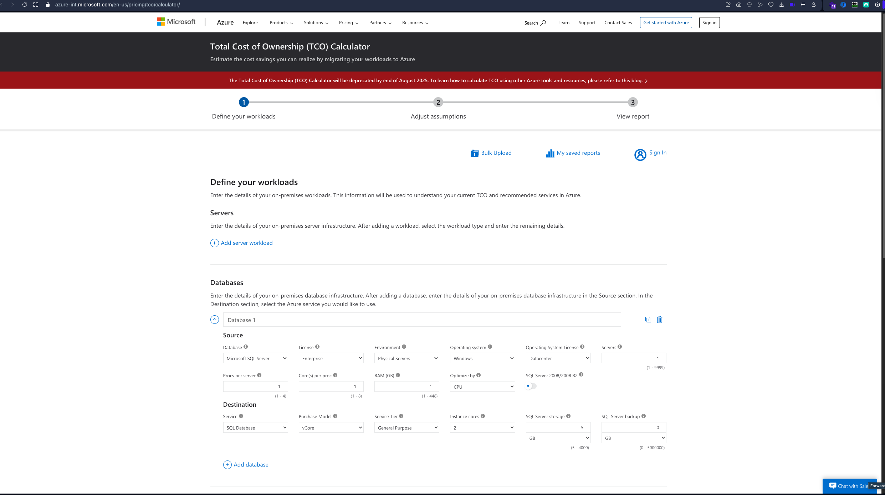
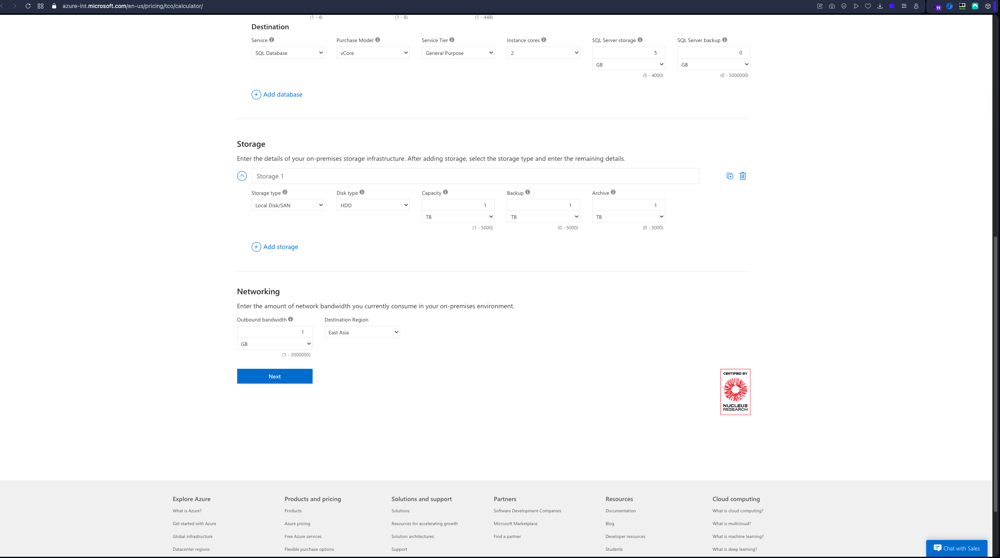
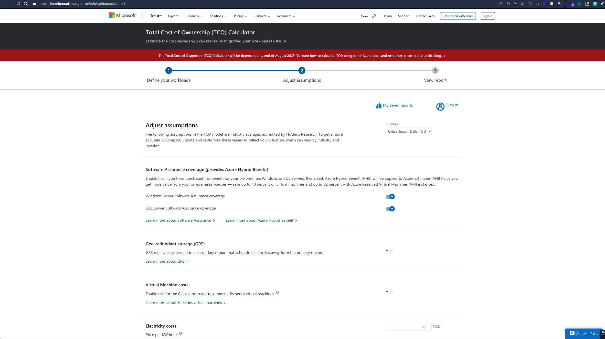
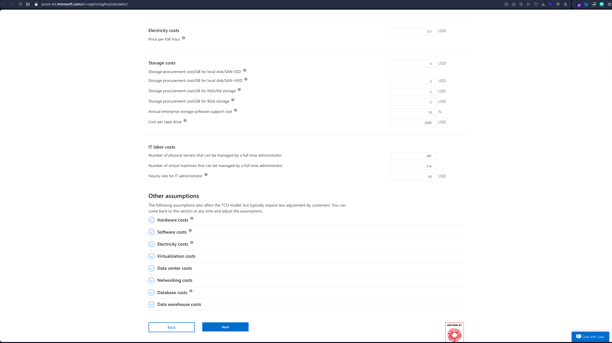
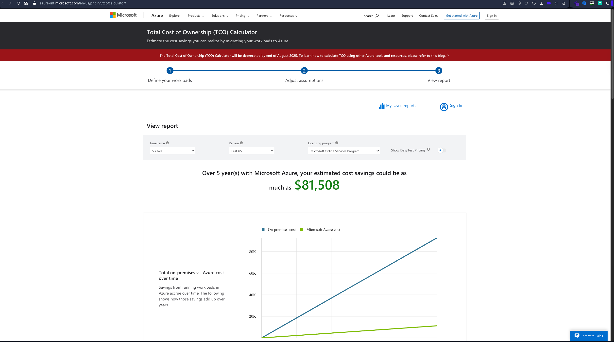
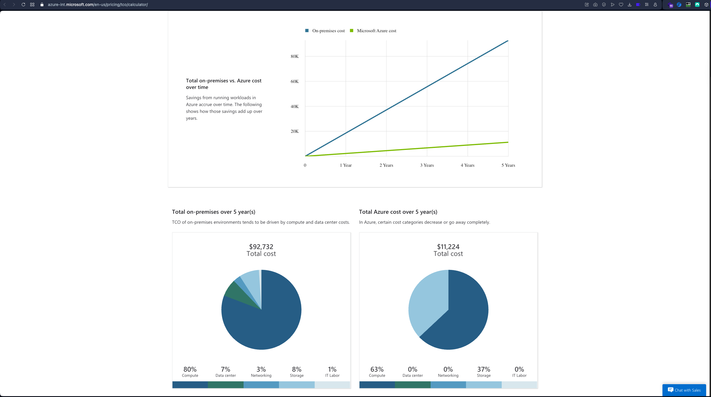
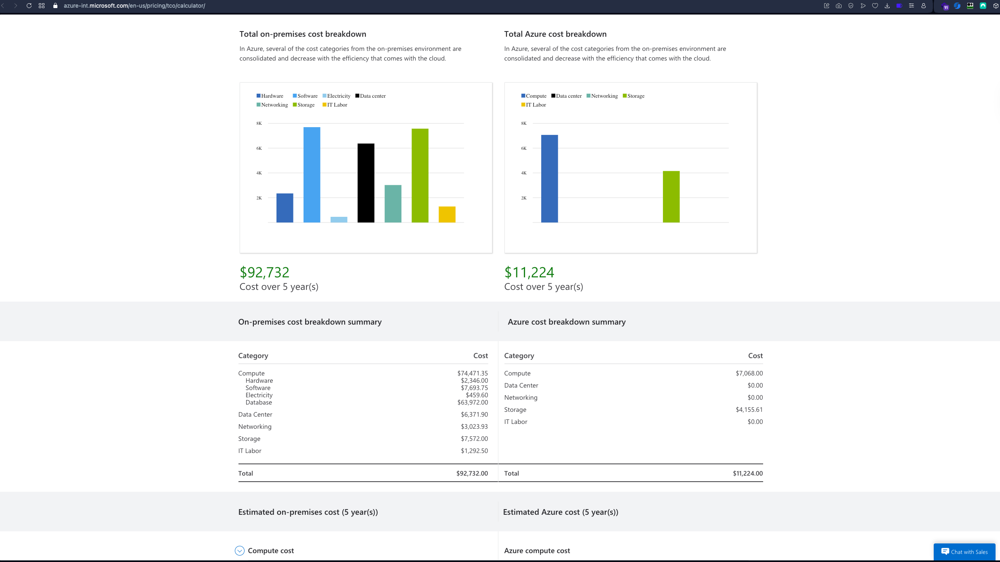
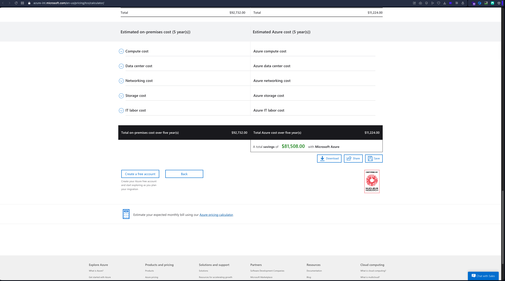

# Azure TCO Calculator - Deprecation and Access Information

## Overview

The Azure Total Cost of Ownership (TCO) Calculator is a tool that helps estimate cost savings when migrating workloads to Azure. However, as of 2025, the tool has been deprecated and is scheduled for removal by the end of August 2025.

## Current Status and Access

### Deprecation Notice

- **Deprecation Date**: End of August 2025
- **Official Announcement**: The deprecation is not prominently announced in the official documentation, which has led to confusion among users
- **Current Status**: The tool is still accessible but will be removed by the end of August 2025

### Access Information

While the official Azure Cost Management documentation ([https://learn.microsoft.com/en-us/azure/cost-management-billing/](https://learn.microsoft.com/en-us/azure/cost-management-billing/)) redirects to a blog post instead of the calculator, the TCO Calculator can still be accessed directly at:

**Direct Access URL**: [https://azure-int.microsoft.com/en-us/pricing/tco/calculator/](https://azure-int.microsoft.com/en-us/pricing/tco/calculator/)

### Documentation Redirect Issue

The official Azure Cost Management documentation links to `https://aka.ms/tco-blog`, which redirects to a Microsoft Tech Community blog post explaining TCO concepts rather than providing access to the calculator:

**Blog Post**: [Understanding the Total Cost of Ownership](https://techcommunity.microsoft.com/blog/FinOpsBlog/understanding-the-total-cost-of-ownership/4419195)

During recording of the official documentation for cost management, the TCO Calculator could not be found through the standard documentation links. After reaching out to Azure Support about this issue, they confirmed that the TCO Calculator is deprecated as of August 2025, even though this deprecation is not announced anywhere in the official documentation, making the documentation misleading for users trying to access the tool.

## Alternative Tools and Resources

Microsoft recommends using alternative tools for TCO calculations:

1. **Azure Pricing Calculator**: Provides granular cost estimation for different Azure services and products
   - Best for: Detailed cost estimation for specific Azure services
   - Access: [Azure Pricing Calculator](https://azure.microsoft.com/pricing/calculator/)

2. **Azure Migrate Business Case Feature**: Preferred approach for estimating cost and savings during migrations
   - Best for: Detailed financial analysis (TCO/ROI) for migration planning
   - Features:
     - TCO calculations with discounts
     - Cost and savings comparison between on-premises and Azure
     - End-of-support (EOS) Windows OS and SQL version considerations
     - Year-on-year cash flow analysis
     - Resource utilization insights
   - Access: Available through Azure Migrate in the Azure Portal

## TCO Calculator Interface

The TCO Calculator interface includes the following sections (as shown in the screenshots below):

- Infrastructure configuration inputs (servers, databases, storage, network)
- Azure environment configuration
- Operational costs estimation
- Cost comparison and savings analysis

### Screenshots

## Comparison with Other Cloud Providers

Other major cloud providers offer comparable TCO calculation tools:

- **AWS**: AWS TCO Calculator
- **Google Cloud**: Google Cloud Pricing Calculator with TCO analysis
- These tools remain actively maintained and available

## Key Elements of TCO Analysis

When performing a TCO analysis for Azure migration, consider:

1. **Current Infrastructure Configuration**:
   - Servers (number, specifications, OS)
   - Databases (type, size, licensing)
   - Storage (type, amount, redundancy)
   - Network traffic (outbound traffic costs)

2. **Azure Environment Configuration**:
   - Virtual Machines (matching current specs)
   - Storage options (tiers, redundancy)
   - Networking components

3. **Operational Costs**:
   - Power and cooling (on-premises)
   - IT labor costs
   - Software licensing (current and Azure)

## Recommendations

- For new TCO calculations, use **Azure Migrate Business Case** feature or **Azure Pricing Calculator**
- If you need to access the legacy TCO Calculator, use the direct URL before August 2025
- Plan migration cost analysis using the recommended alternative tools
- Consider the transition from capital expenditure (CapEx) to operating expenditure (OpEx) model

## References

- [Azure Cost Management + Billing Documentation](https://learn.microsoft.com/en-us/azure/cost-management-billing/)
- [Understanding the Total Cost of Ownership - Microsoft Tech Community](https://techcommunity.microsoft.com/blog/FinOpsBlog/understanding-the-total-cost-of-ownership/4419195)
- [Azure Migrate Business Case Documentation](https://learn.microsoft.com/en-us/azure/migrate/concepts-business-case-calculation)
